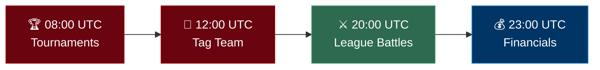

## Overview

The daily cycle is the heartbeat of Armoured Souls. Rather than one big event, each day is split into four scheduled jobs that run at fixed times (UTC). Each job handles a different part of the game — tournaments in the morning, tag team battles at midday, league battles in the evening, and financial processing at night.

You don't need to be online when any of these run. Make your strategic decisions beforehand, and the system handles the rest.

## The Four Daily Jobs

Here's what runs each day and when:



Only one job can run at a time. If two jobs overlap, the second one waits in a queue until the first finishes.

### 08:00 UTC — Tournament Matches

The day starts with tournaments.

1. **Repair all robots** — Every robot is fully repaired before tournament fights begin. Repair costs are deducted from the owner's balance.
2. **Execute tournament matches** — The current round of every active tournament is played. Winners advance to the next round.
3. **Auto-create tournaments** — If no active tournament exists, a new one is automatically created so there's always a tournament running.

### 12:00 UTC — Tag Team Matches

Tag team battles run at midday, but only on odd-numbered cycles (cycle 1, 3, 5, etc.). 

On odd cycles:
1. **Repair all robots** — Full repair pass with costs deducted.
2. **Execute tag team battles** — All scheduled tag team matches are fought.
3. **Rebalance tag team leagues** — Promotions and demotions are processed for tag team standings.
4. **Tag team matchmaking** — New tag team matches are scheduled for the next odd cycle (48-hour lead time).

On even cycles:
1. **Repair all robots** — Repairs still run (robots may have been damaged in the tournament job earlier).
2. **Skip** — No tag team battles, rebalancing, or matchmaking.

### 20:00 UTC — League Battle Matches

This is the main event — your 1v1 league battles.

1. **Repair all robots** — Full repair pass with costs deducted, so every robot enters league battles at full health.
2. **Execute league battles** — All 1v1 matches that were scheduled during the previous cycle's matchmaking are fought. Results include ELO changes, LP gains/losses, credits earned, and streaming revenue.
3. **Rebalance leagues** — Robots in the top 10% of their league instance (with ≥25 LP and ≥5 cycles in the tier) are promoted. Bottom 10% (with ≥5 cycles) are demoted. Instances are rebalanced if they exceed the 100-robot cap.
4. **League matchmaking** — New 1v1 matches are scheduled for the next cycle (24-hour lead time). Robots are paired primarily by LP (±10 ideal, ±20 fallback), with ELO as a secondary quality check.

```callout-tip
Matchmaking runs at the end of the league job, not the beginning. Any changes you make to your robots between cycles — upgrading attributes, swapping weapons, changing stance — will be in effect for the matches scheduled here.
```

### 23:00 UTC — Financial Processing

The day closes with financial processing.

1. **Passive income** — Merchandising revenue from the Merchandising Hub is calculated and credited to your balance, scaled by your Prestige level. (Streaming revenue is not part of this job — it's awarded per battle during the battle jobs.)
2. **Operating costs** — Daily facility costs are deducted, including ₡500/day per robot beyond your first.
3. **Balance logging** — Every player's end-of-day balance is recorded for the audit trail.
4. **Cycle counter increment** — The global cycle number advances, and each robot's "cycles in current league" counter ticks up (this determines promotion/demotion eligibility — you need ≥5 cycles in a tier).
5. **Analytics snapshot** — A complete snapshot of the game state is saved, powering the dashboard analytics and historical views.
6. **Auto-generate users** — New AI-controlled users may be generated to keep the population growing.

```callout-warning
If your balance drops below zero after operating costs are deducted, you're in trouble. Keep an eye on your finances in the [Financial Report](/guide/economy/credits-and-income) to make sure your income covers your expenses.
```

## A Typical Day

Here's how a full day plays out:

| Time (UTC) | What Happens | What You See |
|---|---|---|
| 08:00 | Robots repaired, tournament round played | Tournament results and bracket updates |
| 12:00 | Robots repaired, tag team battles (odd cycles) | Tag team results (every other day) |
| 20:00 | Robots repaired, league battles fought, leagues rebalanced, new matches scheduled | League battle results, LP/ELO changes, promotion/demotion notices, upcoming match preview |
| 23:00 | Income credited, costs deducted, cycle advances | Updated balance, financial summary, cycle snapshot |

## When Should I Make Changes?

The best window for adjustments is between the financial processing job (23:00 UTC) and the next day's tournament job (08:00 UTC). During this window, the cycle has advanced and no jobs are running, so your changes will be in effect for all of the next day's battles.

That said, changes made at any point before a specific job runs will take effect for that job. For example, if you swap weapons at 15:00 UTC, your robots will use the new weapons in the league battles at 20:00 UTC.

```callout-tip
A typical session takes 15–30 minutes. Log in, review your results from the last cycle, make adjustments, and you're set for the next day.
```

## What Should I Check After Each Day?

After the financial processing job completes (after 23:00 UTC), review:

- **[Battle results](/guide/combat/battle-flow)** — Detailed logs from league, tag team, and tournament battles
- **[Financial summary](/guide/economy/credits-and-income)** — Income earned, costs deducted, and net change
- **[League standings](/guide/leagues/league-tiers)** — Check for promotions, demotions, or robots close to thresholds
- **Upcoming matches** — See who your robots are matched against for tomorrow's battles

## Related Topics

- [Core Game Loop](/guide/getting-started/core-game-loop) — The five-step cycle of play
- [League Tiers](/guide/leagues/league-tiers) — How the six competitive tiers work
- [Economy Overview](/guide/economy/credits-and-income) — Understanding income and expenses
