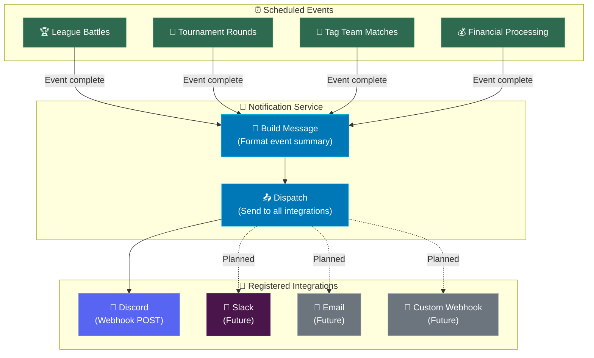

## Overview

This article provides a visual diagram of the complete notification flow — from the moment a scheduled event completes to the message arriving in your Discord channel (or other connected platform).


## The Notification Flow



## Flow Breakdown

### 1. Event Completion

The daily cycle runs several scheduled jobs. When each job finishes processing, it triggers the Notification Service with the results:

- **League battles** — All matchmaking and battle resolution completes
- **Tournament rounds** — The current tournament round resolves
- **Tag team matches** — Team-based battles complete
- **Financial processing** — Income credited, expenses deducted, balances updated

### 2. Message Building

The Notification Service receives the event results and constructs a formatted message. Each event type has its own message template:

- Battle results include win/loss records, LP changes, and notable performances
- Tournament messages show bracket updates and eliminations
- Financial messages summarize revenue, expenses, and net income

Messages are built as platform-agnostic text that can be formatted for any delivery target.

### 3. Dispatch

The service iterates through all registered integrations and calls each one's send method with the formatted message. Currently, Discord is the primary integration — future integrations (Slack, email, custom webhooks) will plug in at this same dispatch point.

```callout-info
Each integration handles its own delivery independently. If Discord delivery fails, it doesn't prevent future integrations from receiving the message. The system is designed so that one broken integration doesn't affect others.
```

### 4. Delivery

The Discord integration takes the message and sends it as an HTTP POST to the configured webhook URL. Discord renders it as a formatted message in the target channel. The entire flow — from event completion to Discord message — typically completes within a few seconds.

## Error Handling

| Failure Point | What Happens | Impact |
|--------------|-------------|--------|
| Message building fails | Error logged, no dispatch | No notifications for this event |
| Discord webhook returns error | Error logged, other integrations still receive | Discord notification missed |
| Network timeout | Error logged, no retry | Notification lost for this cycle |
| Invalid webhook URL | Error logged on every attempt | No Discord notifications until fixed |

```callout-tip
The notification system never blocks or delays game processing. Even if every integration fails, the game cycle completes normally. Notifications are a convenience layer on top of the core game — they're nice to have, not critical to gameplay.
```

## What's Next?

- [Notification Service](/guide/integrations/notification-service) — Detailed explanation of the service
- [Integration Interface](/guide/integrations/integration-interface) — How integrations plug in
- [Webhook Setup](/guide/integrations/webhook-setup) — Configure your Discord webhook
