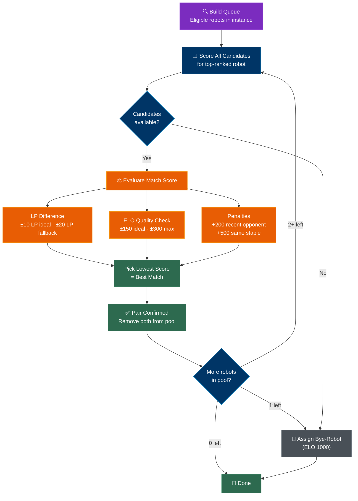

## Overview

Matchmaking is the engine that drives the competitive loop in Armoured Souls. Every cycle, the system pairs robots for battle based on their **League Points (LP)** as the primary factor and **ELO rating** as a secondary quality check. The goal is fair, competitive matches where both robots have a realistic chance of winning.

You don't choose your opponents — the matchmaking algorithm handles everything automatically. Understanding how it works helps you interpret your matchups and plan your strategy.


## How Matching Works

Matchmaking runs once per cycle as part of the [daily cycle](/guide/getting-started/daily-cycle). The system processes each league tier independently, from Bronze through Champion, and within each tier, each instance is matched separately.

The algorithm uses a **scoring system** to evaluate every possible pairing. Each candidate opponent gets a match score — lower is better. The system considers LP difference, ELO difference, recent opponent history, and stable ownership, then picks the best-scored opponent for each robot.



### The Scoring System

The matchmaking algorithm doesn't use hard cutoffs. Instead, it scores every potential opponent and picks the one with the lowest (best) score. The score is built from four factors:

**1. LP Difference (Primary Factor)**

LP is the most important matching criterion. The closer two robots are in LP, the lower the score penalty:

| LP Difference | Score Penalty | Description |
|--------------|--------------|-------------|
| ±10 LP (ideal) | 1× the difference | Minimal penalty — best matches |
| ±20 LP (fallback) | 5× the difference | Moderate penalty — acceptable matches |
| Beyond ±20 LP | 20× the difference | Heavy penalty — avoided when possible |

**2. ELO Difference (Secondary Factor)**

ELO acts as a quality check on top of LP matching:

| ELO Difference | Score Penalty | Description |
|---------------|--------------|-------------|
| ±150 ELO (ideal) | 0.1× the difference | Minimal — good skill match |
| ±300 ELO (fallback) | 0.5× the difference | Moderate — acceptable skill gap |
| Beyond ±300 ELO | +1000 flat penalty | Effectively rejected |

**3. Recent Opponent Penalty (+200)**

The system tracks your last **5 opponents**. If a candidate was a recent opponent, a +200 penalty is added. This applies from both sides — if both robots have each other in their recent history, the penalty stacks to +400.

**4. Same-Stable Penalty (+500)**

Robots owned by the same player receive a heavy +500 penalty. This strongly discourages same-stable matches but doesn't prevent them entirely — in small instances, it may be the only option.

```callout-info
LP and ELO serve different purposes. A robot with high LP but low ELO is on a hot streak but may not be fundamentally strong. A robot with high ELO but low LP is skilled but having a rough patch. The scoring system accounts for both dimensions.
```

### The Pairing Process

The algorithm works through the queue from top to bottom:

1. Take the highest-ranked robot (sorted by LP, then ELO)
2. Score all remaining robots as potential opponents
3. Pick the lowest-scored (best) opponent
4. Remove both from the pool
5. Repeat until fewer than 2 robots remain
6. If exactly 1 robot is left, assign a bye-match

This greedy approach means the top-ranked robots get first pick of opponents, which generally produces the best overall match quality.

### Bye-Robots

A bye-robot is assigned when there's an **odd number** of eligible robots in an instance. The leftover robot (the last one remaining after all pairs are formed) is matched against a special weak opponent (ELO 1000) that provides an easy win with full rewards. Bye matches ensure no robot sits out a cycle.

```callout-tip
Bye matches are not a punishment. They're a guarantee that every eligible robot gets to fight every cycle, even when the numbers don't work out evenly.
```

## Scheduling Readiness

Not every robot is eligible for matchmaking. To be scheduled for a match, your robot must have the correct weapons equipped for its loadout type:

| Loadout Type | Requirement |
|-------------|-------------|
| Single | Main weapon equipped |
| Dual-Wield | Main weapon AND offhand weapon equipped |
| Weapon+Shield | Main weapon AND shield equipped |
| Two-Handed | Two-handed main weapon equipped |

```callout-tip
HP is NOT checked at scheduling time. The daily cycle runs repairs before executing battles, so your robot's current HP doesn't affect matchmaking eligibility. Only weapon loadout matters for scheduling.
```

### Battle Readiness (Execution Time)

Since repairs run automatically before battles execute, the only readiness check that matters is:

- **All required weapons equipped** for your loadout type

Keep your robots properly equipped to avoid missed battles. HP is not a factor — the auto-repair step ensures all robots enter battle at full health.

## League Boundaries

Matchmaking respects league boundaries strictly:

- Bronze robots only fight Bronze robots
- Silver robots only fight Silver robots
- And so on through Champion

There is no cross-tier matchmaking. Your league tier is an absolute boundary. Each instance within a tier is also matched independently — there is no cross-instance fallback. Your opponents will always come from your own instance.

## What's Next?

- [League Points](/guide/leagues/league-points) — How LP is earned through wins, losses, and draws
- [League Tiers & Instances](/guide/leagues/league-tiers) — The six tiers and how instances work
- [Promotion & Demotion](/guide/leagues/promotion-demotion) — How matchmaking performance leads to tier changes
- [Battle Flow](/guide/combat/battle-flow) — What happens when your matched battle actually executes
