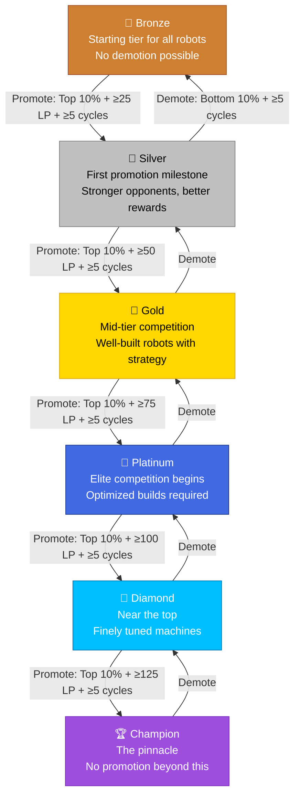

## Overview

Promotion and demotion are the mechanisms that move robots between [league tiers](/guide/leagues/league-tiers). They run automatically after every cycle — no manual action required. If your robot meets the promotion criteria, it moves up. If it falls into the demotion zone, it moves down.

The system is designed for **stable progression**. Multiple requirements must be met simultaneously, and built-in protections prevent the frustrating "yo-yo" effect of bouncing between tiers. Climbing a tier should feel earned, and dropping one should feel like a clear signal to adjust your strategy.


## The Tier Progression Path



Each arrow represents a tier change. Promotion requires meeting all three criteria (top 10% of instance, per-tier LP threshold, ≥5 cycles). Demotion requires being in the bottom 10% after ≥5 cycles. Bronze has no demotion, and Champion has no promotion.

## Promotion Requirements

To be promoted to the next tier, your robot must meet **all three** of these conditions at the end of a cycle:

| Requirement | Threshold | Why It Exists |
|-------------|-----------|---------------|
| **Instance Rank** | Top 10% of your instance | Ensures you're outperforming most of your direct competition |
| **League Points** | Per-tier threshold (see below) | Proves sustained winning performance, not just a lucky cycle |
| **Time in Tier** | ≥5 cycles in current tier | Prevents premature promotion before you've established yourself |

All three must be true at the same time. Missing even one means you stay in your current tier until the next cycle evaluation.

### LP Required Per Promotion

Higher tiers demand more LP to earn promotion. The thresholds increase by 25 LP per tier, reflecting the greater challenge of climbing through stronger competition. Because LP carries over when you're promoted, you don't reset to 0 — but you need to reach the next tier's threshold to keep climbing.

| Promotion | LP Required | Notes |
|-----------|-------------|-------|
| Bronze → Silver | ≥25 LP | Your first milestone. At +3 per win / -1 per loss, a 60% win rate gets you there in ~10-12 cycles. |
| Silver → Gold | ≥50 LP | LP carried over from Bronze gives you a head start. |
| Gold → Platinum | ≥75 LP | Competition is tougher — maintaining 25+ LP takes more consistent wins. |
| Platinum → Diamond | ≥100 LP | Optimized builds are the norm. Every win matters. |
| Diamond → Champion | ≥125 LP | The final gate. Only the top performers in Diamond break through. |

```callout-info
Since LP carries over, a robot promoted from Bronze with 32 LP enters Silver with 32 LP. But the Silver→Gold threshold is 50 LP, so you'll need to keep winning to reach it. Tougher opponents in the new tier may slow your LP growth — the real challenge is building momentum against stronger competition.
```

### How the Top 10% Works

The top 10% is calculated per **instance**, not per tier. If your instance has 80 eligible robots, the top 10% is the top 8 robots by LP ranking (with ELO as a tiebreaker for identical LP).

Only robots that have completed ≥5 cycles in the current tier are counted as eligible for the percentage calculation. New arrivals don't dilute the pool.

```callout-tip
Being in the top 10% by LP means you need to be winning more than most robots in your instance. Focus on consistent wins rather than occasional big victories — the +3 LP per win adds up faster than you might expect.
```

### The 5-Cycle Minimum

You must spend at least **5 cycles** in your current tier before becoming eligible for promotion. This prevents robots from being promoted immediately after arriving in a new tier — you need time to prove you belong before moving up again.

The cycle counter resets to 0 whenever you change tiers (whether through promotion or demotion).

```callout-info
The 5-cycle minimum applies to both promotion AND demotion eligibility. This is what creates the automatic demotion protection for newly promoted robots — more on that below.
```

## Demotion Rules

Demotion is simpler than promotion. Your robot faces demotion if it meets **both** of these conditions:

| Requirement | Threshold | Why It Exists |
|-------------|-----------|---------------|
| **Instance Rank** | Bottom 10% of your instance | You're underperforming relative to your competition |
| **Time in Tier** | ≥5 cycles in current tier | Prevents immediate demotion before you've had a chance to adapt |

There is **no LP threshold** for demotion — being in the bottom 10% after 5 cycles is enough. However, robots with very low LP are more likely to be in the bottom 10%, so LP still matters indirectly.

### Special Cases

- **Bronze league** — There is no demotion from Bronze. It's the lowest tier, so robots at the bottom of Bronze stay in Bronze.
- **Champion league** — There is no promotion from Champion. It's the highest tier. Champion robots can only be demoted back to Diamond.
- **Small instances** — If an instance has fewer than 10 eligible robots, promotion and demotion are skipped entirely. The system needs a meaningful population to calculate fair percentages.

## LP Retention

When your robot changes tiers — whether through promotion or demotion — your **League Points carry over**. There is no LP reset.

### On Promotion

If you earned 32 LP in Bronze and get promoted to Silver, you start Silver with 32 LP. This means:

- You enter the new tier with an established position in the standings, not at the bottom
- You have a buffer against early losses while you adjust to tougher competition
- Your momentum from the previous tier translates directly into your new tier

Without LP retention, every promotion would feel like starting over. With it, promotion feels like a continuation of your upward trajectory.

### On Demotion

If you're demoted from Silver back to Bronze with 8 LP, you keep those 8 LP. This means:

- You're not punished beyond the tier drop itself
- You have a foundation to rebuild from rather than starting at zero
- Recovery is faster because you don't need to re-earn LP from scratch

```callout-info
LP retention works the same in both directions. The system doesn't distinguish between promotion LP and demotion LP — your points are your points, regardless of how you got them.
```

## Demotion Protection

When a robot is promoted to a new tier, its **cycle counter resets to 0**. Since demotion requires ≥5 cycles in the current tier, this automatically gives newly promoted robots a **5-cycle grace period** where they cannot be demoted.

This protection is critical for healthy progression:

- It gives you time to adjust to stronger opponents in the new tier
- It prevents the frustrating scenario of being promoted and immediately demoted
- It encourages players to push for promotion without fear of instant punishment

### What This Means in Practice

| Cycle in New Tier | Demotion Possible? | What You Should Do |
|-------------------|-------------------|-------------------|
| Cycle 1 | ❌ Protected | Observe the competition, learn opponent patterns |
| Cycle 2 | ❌ Protected | Experiment with stance or loadout adjustments |
| Cycle 3 | ❌ Protected | Fine-tune your build based on battle results |
| Cycle 4 | ❌ Protected | Solidify your strategy for the new tier |
| Cycle 5 | ❌ Protected | Last safe cycle — prepare for full competition |
| Cycle 6+ | ✅ At risk | You're now evaluated like every other robot in the tier |

```callout-tip
The 5-cycle protection isn't just a safety net — it's a learning window. Use it actively. Review your battle logs, study what the top robots in your new tier are doing differently, and adjust before the protection expires.
```

### Protection Resets on Every Tier Change

The protection applies every time you change tiers. If you're promoted from Bronze to Silver, you get 5 cycles of protection. If you're later promoted from Silver to Gold, you get another 5 cycles. If you're demoted from Gold back to Silver, the cycle counter resets again — giving you 5 cycles before you can be demoted further.

This prevents cascading demotions where a robot drops multiple tiers in quick succession.

## When Promotion and Demotion Happen

League rebalancing runs as part of the daily cycle, in this order:

1. **Repairs** — All robots are repaired
2. **Battles execute** — Scheduled matches are fought
3. **League rebalancing** — Promotions and demotions are processed
4. **Matchmaking** — New matches are scheduled for the next cycle

Promotions and demotions happen **after** battles complete, so your final battle result for the cycle counts toward your LP and ranking before the evaluation runs.

Each instance is processed independently. The system evaluates all instances across all tiers in a single pass, from Bronze through Champion.

## After a Tier Change

When your robot is promoted or demoted:

| What Changes | What Stays |
|-------------|------------|
| League tier (e.g., Bronze → Silver) | League Points (LP carries over) |
| Instance assignment (placed in instance with most space) | ELO rating (preserved) |
| Cycle counter (resets to 0) | Win/loss record |
| Opponents (new tier, new competition) | Robot attributes and equipment |

```callout-info
Your robot is placed in the instance with the most available space in the new tier. You can't choose your instance — the system handles placement automatically to keep populations balanced.
```

## The Realistic Journey

Here's what a typical progression from Bronze to Gold might look like:

### Phase 1: Bronze (Cycles 1-12)

- Start with 0 LP and 1200 ELO
- Win rate around 55-60% as you learn the game
- LP accumulates steadily: roughly +2 LP per cycle at 60% win rate
- By cycle 8-10, you've hit 25+ LP and are in the top 10%
- **Promoted to Silver** around cycle 10-12 with ~28-35 LP

### Phase 2: Silver (Cycles 13-30)

- Enter Silver with your Bronze LP intact (e.g., 30 LP)
- Opponents are stronger — win rate may drop to 45-50% initially
- 5-cycle protection gives you breathing room
- LP may dip slightly during adjustment, then stabilize
- Need to reach 50 LP for Gold promotion (higher threshold than Bronze→Silver)
- By cycle 25-30, you've adapted, rebuilt LP, and are pushing top 10% again
- **Promoted to Gold** around cycle 28-32

### Phase 3: Gold and Beyond

- Each tier takes longer to master as competition intensifies
- LP thresholds increase: 75 for Platinum, 100 for Diamond, 125 for Champion
- Earning LP is harder against better opponents
- Expect 15-25 cycles per tier at higher levels
- Not every robot reaches Champion — and that's by design

```callout-info
The journey from Bronze to Champion typically takes 60-100+ cycles for a well-managed robot. There's no shortcut — consistent performance over time is the only path. This is intentional: tier progression is the game's primary long-term goal.
```

## Practical Example

Here's how a typical promotion plays out:

1. **Cycle 1-4**: Your robot wins consistently in `bronze_1`, accumulating LP. Cycle counter: 1, 2, 3, 4.
2. **Cycle 5**: You've reached 28 LP and you're ranked #3 out of 85 eligible robots (top 3.5%). All three requirements are met — top 10%, ≥25 LP, ≥5 cycles.
3. **End of Cycle 5**: The rebalancing system promotes your robot to Silver. LP stays at 28, ELO stays the same, cycle counter resets to 0.
4. **Cycle 6-10 (Silver)**: You're in a new instance with stronger opponents. Your 28 LP gives you a solid starting position. The 5-cycle protection means you can't be demoted yet.
5. **Cycle 11+**: Protection expires. If you've adapted well, you'll be climbing toward Gold. If not, demotion risk begins.

## Progression Tips

### Climbing Faster

- **Invest in key attributes** — A well-rounded robot with strong fundamentals wins more consistently than a min-maxed build with glaring weaknesses
- **Match your loadout to your strategy** — See the [Loadout Types](/guide/weapons/loadout-types) guide for how each configuration supports different playstyles
- **Manage your finances** — Higher tiers mean higher rewards but also tougher opponents. Don't neglect [facility upgrades](/guide/facilities/facility-overview) that improve your robot's performance
- **Study your battle logs** — Every loss contains information about what to improve

### Avoiding Demotion

- **Keep robots equipped** — A robot without weapons can't fight, which means missed cycles and stagnant LP
- **Don't ignore demotion warnings** — If you're in the bottom 20% of your instance, take action before you hit the bottom 10%
- **Adapt to your tier** — What worked in Bronze may not work in Silver. Be willing to change your stance, loadout, or attribute priorities

## What's Next?

- [League Points](/guide/leagues/league-points) — How LP is earned and why it drives promotion
- [League Tiers & Instances](/guide/leagues/league-tiers) — The six tiers and instance system
- [Matchmaking](/guide/leagues/matchmaking) — How opponents are paired within your tier
- [Build Archetypes](/guide/strategy/build-archetypes) — Proven build strategies for competitive play
- [Battle Flow](/guide/combat/battle-flow) — How battles are resolved to determine your LP outcome
