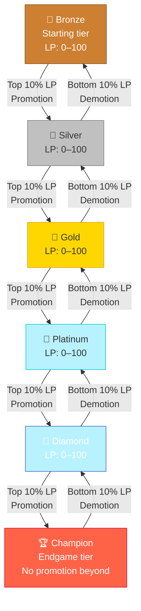

## Overview

Tier progression is the competitive backbone of Armoured Souls. Every robot starts in Bronze and can climb all the way to Champion through consistent performance. The journey is driven by **League Points (LP)** — earn enough and you enter the promotion zone; fall too low and you risk demotion.

Understanding how progression works helps you set realistic goals, plan your attribute investments, and know when to push for promotion versus consolidating your position.

## The Progression Path



## How Promotion Works

At the end of each cycle, the game evaluates every league instance independently:

1. Robots are ranked by LP within their instance
2. The **top 10%** enter the promotion zone
3. Promoted robots move to the next tier with **50% of their LP** carried over
4. They're placed in the instance with the most available space

Promotion is evaluated per-instance, not per-tier. Being in the top 10% of your specific instance is what matters.

```callout-tip
LP retention on promotion means you don't start from zero in your new tier. Carrying 50% of your LP gives you a head start, but you'll still need to prove yourself against stronger opponents.
```

## How Demotion Works

The flip side of promotion — robots in the **bottom 10%** of their instance by LP are demoted to the tier below:

- Demoted robots keep **75% of their LP** in the lower tier
- They're placed in the instance with the most available space
- Champion-tier robots can be demoted to Diamond (Champion isn't safe)

```callout-info
Demotion retains more LP (75%) than promotion carries forward (50%). This softens the blow — a demoted robot isn't starting from scratch and can often climb back quickly.
```

## LP Accumulation by Tier

LP is earned from wins and lost from defeats. The amount scales with tier:

| Tier | LP per Win | LP per Loss | Matches to Promote (approx.) |
|------|-----------|-------------|------------------------------|
| Bronze | +8–12 | -3–5 | ~15–20 wins |
| Silver | +7–11 | -4–6 | ~18–25 wins |
| Gold | +6–10 | -4–7 | ~20–30 wins |
| Platinum | +5–9 | -5–7 | ~25–35 wins |
| Diamond | +4–8 | -5–8 | ~30–40 wins |
| Champion | +3–7 | -5–8 | N/A (endgame) |

The exact LP gain depends on the ELO difference between you and your opponent. Beating a higher-rated opponent earns more LP; losing to a lower-rated one costs more.

## Progression Timeline

A well-built robot with consistent wins can expect roughly this progression:

| Milestone | Approximate Cycle |
|-----------|------------------|
| Bronze → Silver | Cycles 10–20 |
| Silver → Gold | Cycles 30–50 |
| Gold → Platinum | Cycles 60–100 |
| Platinum → Diamond | Cycles 100–160 |
| Diamond → Champion | Cycles 160–250+ |

These are rough estimates. Actual progression depends on your win rate, the strength of your instance, and how much you invest in your robot's attributes.

```callout-warning
Don't expect linear progression. Each tier jump brings significantly tougher opponents. It's normal to plateau for a while as you build up the attributes needed to compete at the next level.
```

## Strategic Considerations

- **Don't rush promotion** — Being the weakest robot in a higher tier means more losses, more repair costs, and potential demotion
- **Consolidate before pushing** — Build up attributes and reserves before aiming for the promotion zone
- **Multiple robots spread risk** — If one robot gets demoted, others can still earn income at higher tiers
- **Watch your instance** — Know who your top competitors are and whether you're realistically in the top 10%

## What's Next?

- [League Tiers](/guide/leagues/league-tiers) — Detailed breakdown of each tier and the instance system
- [League Points](/guide/leagues/league-points) — How LP is calculated and what affects gains/losses
- [Promotion & Demotion](/guide/leagues/promotion-demotion) — The full rules for tier changes
- [Battle Rewards](/guide/economy/battle-rewards) — How tier affects your income
