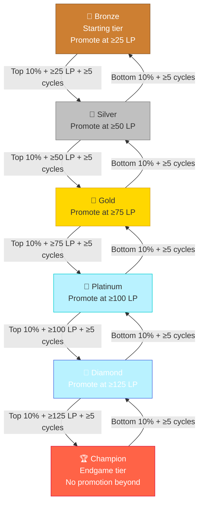

## Overview

Tier progression is the competitive backbone of Armoured Souls. Every robot starts in Bronze and can climb all the way to Champion through consistent performance. The journey is driven by **League Points (LP)** — earn enough, spend enough time in your tier, and rank high enough in your instance, and you earn promotion.

Understanding how progression works helps you set realistic goals, plan your attribute investments, and know when to push for promotion versus consolidating your position.

## The Progression Path


```mermaid
flowchart TD
    B["🥉 Bronze\nStarting tier\nPromote at ≥25 LP"]
    S["🥈 Silver\nPromote at ≥50 LP"]
    G["🥇 Gold\nPromote at ≥75 LP"]
    P["💎 Platinum\nPromote at ≥100 LP"]
    D["💠 Diamond\nPromote at ≥125 LP"]
    C["🏆 Champion\nEndgame tier\nNo promotion beyond"]

    B -->|"Top 10% + ≥25 LP + ≥5 cycles"| S
    S -->|"Top 10% + ≥50 LP + ≥5 cycles"| G
    G -->|"Top 10% + ≥75 LP + ≥5 cycles"| P
    P -->|"Top 10% + ≥100 LP + ≥5 cycles"| D
    D -->|"Top 10% + ≥125 LP + ≥5 cycles"| C

    S -->|"Bottom 10% + ≥5 cycles"| B
    G -->|"Bottom 10% + ≥5 cycles"| S
    P -->|"Bottom 10% + ≥5 cycles"| G
    D -->|"Bottom 10% + ≥5 cycles"| P
    C -->|"Bottom 10% + ≥5 cycles"| D

    style B fill:#cd7f32,stroke:#8b5a2b,color:#fff
    style S fill:#c0c0c0,stroke:#808080,color:#333
    style G fill:#ffd700,stroke:#daa520,color:#333
    style P fill:#b9f2ff,stroke:#00ced1,color:#333
    style D fill:#b9f2ff,stroke:#4169e1,color:#fff
    style C fill:#ff6347,stroke:#dc143c,color:#fff
```

## How Promotion Works

At the end of each cycle, the game evaluates every league instance independently. To be promoted, your robot must meet **all three** conditions at the same time:

1. **Top 10%** — Ranked in the top 10% of your instance by LP
2. **LP threshold** — Reached the per-tier LP requirement (see table below)
3. **Time in tier** — Spent at least 5 cycles in your current tier

| Promotion | LP Required |
|-----------|-------------|
| Bronze → Silver | ≥25 LP |
| Silver → Gold | ≥50 LP |
| Gold → Platinum | ≥75 LP |
| Platinum → Diamond | ≥100 LP |
| Diamond → Champion | ≥125 LP |

Promoted robots keep their full LP in the new tier — there's no reset or reduction. You enter your new tier with the same LP you earned in the old one.

```callout-tip
LP retention means you don't start from zero in your new tier. If you're promoted with 30 LP from Bronze, you enter Silver with 30 LP. But the Silver→Gold threshold is 50 LP, so you'll still need to keep winning against tougher competition.
```

## How Demotion Works

Robots in the **bottom 10%** of their instance who have spent at least 5 cycles in the current tier are demoted to the tier below:

- Demoted robots keep their full LP (no reduction)
- They're placed in the instance with the most available space
- Champion-tier robots can be demoted to Diamond (Champion isn't safe)
- Bronze has no demotion — it's the lowest tier

### Demotion Protection

When a robot changes tiers (promotion or demotion), its cycle counter resets to 0. Since demotion requires ≥5 cycles, this creates an automatic **5-cycle grace period** where newly arrived robots cannot be demoted. Use this window to adapt to your new competition level.

```callout-info
The 5-cycle protection prevents yo-yoing between tiers. You always have time to adjust before being evaluated again.
```

## LP Accumulation

LP is earned from battles with a simple, flat system that applies equally across all tiers:

| Result | LP Change |
|--------|-----------|
| **Win** | +3 LP |
| **Draw** | +1 LP |
| **Loss** | -1 LP |

LP cannot drop below 0. There are no ELO-based modifiers — every win is worth +3, every loss costs -1, regardless of opponent strength or your current tier.

```callout-tip
The asymmetric system (+3 win / -1 loss) is generous. Even a robot that wins 1 in 3 matches breaks even. A 60% win rate earns roughly +2 LP per cycle. Reaching the Bronze→Silver threshold of 25 LP takes around 10-12 cycles at that rate.
```

## Progression Timeline

A well-built robot with a consistent 60% win rate can expect roughly this pace:

| Milestone | Approximate Cycles | LP Needed |
|-----------|-------------------|-----------|
| Bronze → Silver | 10–15 cycles | 25 LP |
| Silver → Gold | 15–25 cycles after Silver | 50 LP |
| Gold → Platinum | 20–35 cycles after Gold | 75 LP |
| Platinum → Diamond | 30–50 cycles after Platinum | 100 LP |
| Diamond → Champion | 40–60+ cycles after Diamond | 125 LP |

These are estimates. Actual progression depends on your win rate, the strength of your instance, and the 5-cycle minimum requirement. Each tier brings tougher opponents, which may lower your win rate and slow LP accumulation.

```callout-warning
Don't expect linear progression. Each tier jump brings significantly tougher opponents. It's normal to plateau while you build up attributes and refine your strategy for the next level of competition.
```

## Tier Progression Across All Modes

The six-tier system (Bronze through Champion) applies to all competitive modes in the game:

| Mode | Entity | Notes |
|------|--------|-------|
| **1v1 League** | Robot | Standard LP-based progression |
| **2v2 League** | Team | Same tier system, team LP |
| **3v3 League** | Team | Same tier system, team LP |
| **Tag Team** | Team | Separate LP track from 2v2 league |
| **King of the Hill** | Robot | Position-based ranking, no LP threshold, 10-cycle minimum |
| **Grand Melee** | Robot | Position-based ranking, no LP threshold, 10-cycle minimum |

KotH and Grand Melee use position-based scoring instead of LP thresholds for promotion, and require 10 cycles in tier instead of 5. All other mechanics (top/bottom 10%, instance system, demotion protection) work the same way.

## Strategic Considerations

- **Don't rush promotion** — Being the weakest robot in a higher tier means more losses, more repair costs, and potential demotion after your protection expires
- **Consolidate before pushing** — Build up attributes and reserves before aiming for the promotion zone
- **Multiple robots spread risk** — If one robot gets demoted, others can still earn income at higher tiers
- **Watch your instance** — Know who your top competitors are and whether you're realistically in the top 10%
- **Use your grace period** — After promotion, you have 5 cycles to adapt without demotion risk. Study battle logs and adjust your build

## What's Next?

- [League Tiers](/guide/leagues/league-tiers) — Detailed breakdown of each tier and the instance system
- [League Points](/guide/leagues/league-points) — How LP is calculated and what affects gains/losses
- [Promotion & Demotion](/guide/leagues/promotion-demotion) — The full rules for tier changes, including protection mechanics
- [Battle Rewards](/guide/economy/battle-rewards) — How tier affects your income
