# Armoured Souls — Architecture Diagrams

## 1. High-Level System Architecture

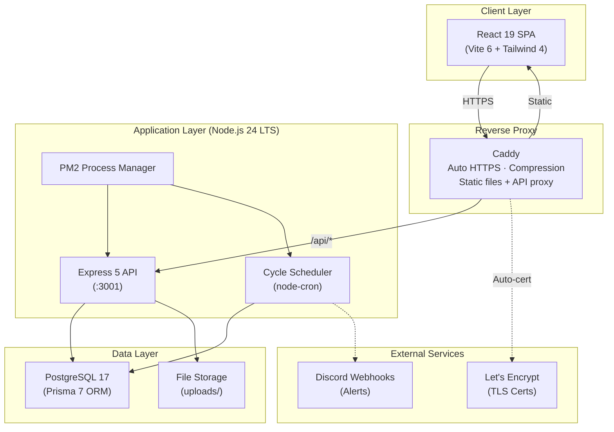

## 2. Backend Service Domain Map

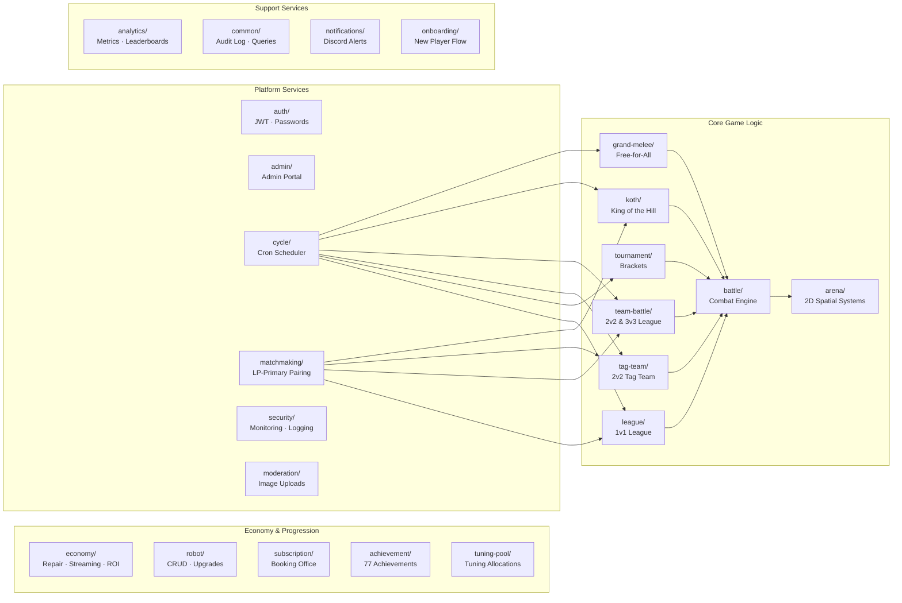

## 3. Battle Cycle Flow (Daily Cron Schedule)

```mermaid
gantt
    title Daily Cron Schedule (UTC)
    dateFormat HH:mm
    axisFormat %H:%M

    section Battles
    1v1 League         :08:00, 30min
    2v2 League         :09:00, 30min
    1v1 Tournament     :10:00, 30min
    Tag Team           :11:00, 30min
    KotH               :13:00, 30min
    3v3 League         :14:00, 30min
    2v2 Tournament     :15:00, 30min
    Grand Melee        :17:00, 30min
    3v3 Tournament     :18:00, 30min

    section Settlement
    Settlement         :00:00, 30min
    Health Report      :00:30, 15min

    section Maintenance
    Battle Log Retention :01:30, 15min
    Database Backup      :02:00, 30min
```

## 4. Battle Execution Pipeline

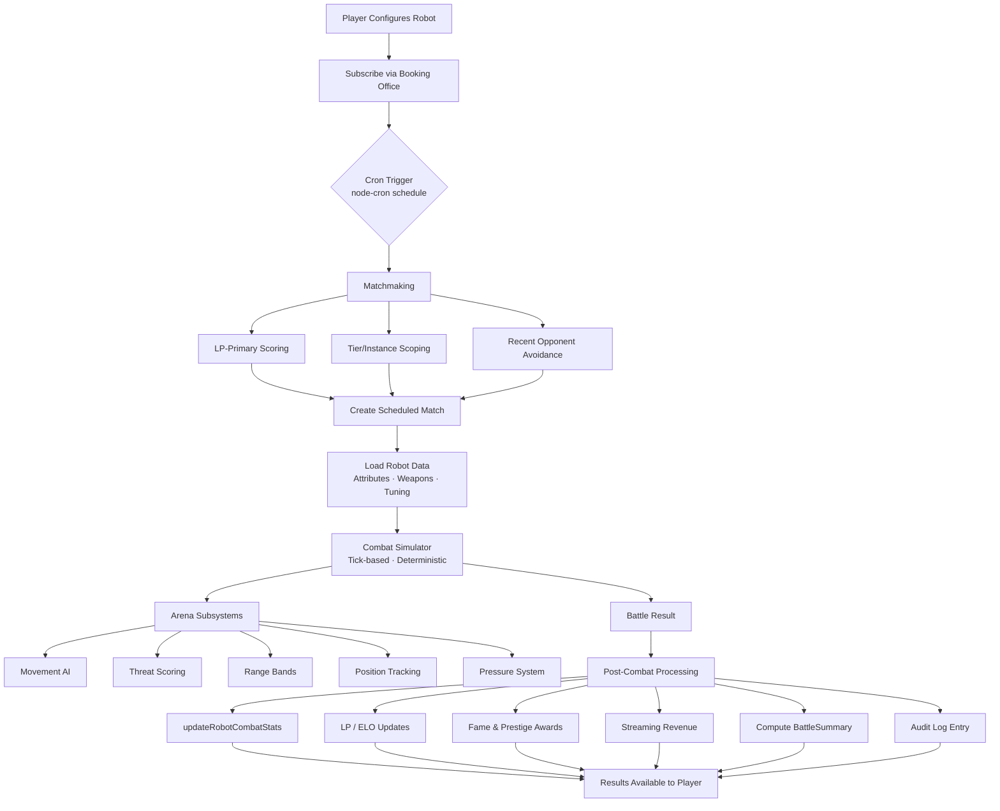

## 5. Authentication & Request Flow

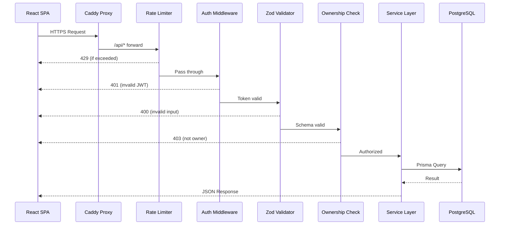

## 6. Economy Flow

```mermaid
flowchart LR
    subgraph Income["Income Sources"]
        StreamRev["Streaming Revenue<br/>(per battle)"]
        PrizePool["Tournament Prizes"]
        LeagueReward["League Rewards"]
    end

    subgraph Wallet["Player Credits (₡)"]
        Balance["Current Balance"]
    end

    subgraph Spending["Spending (lockUserForSpending)"]
        WeaponBuy["Weapon Purchase"]
        FacUpgrade["Facility Upgrade"]
        RobotCreate["Robot Creation"]
        AttrUpgrade["Attribute Upgrade"]
        Repair["Robot Repair"]
    end

    Income --> Balance
    Balance --> Spending

    subgraph Guards["Transaction Guards"]
        CreditLock["Advisory Lock<br/>(serialized)"]
        ReRead["Re-read state<br/>(post-lock)"]
        Validate["Validate funds<br/>& prerequisites"]
    end

    Spending --> Guards --> DB["PostgreSQL<br/>(Interactive Tx)"]
```

## 7. Frontend Architecture

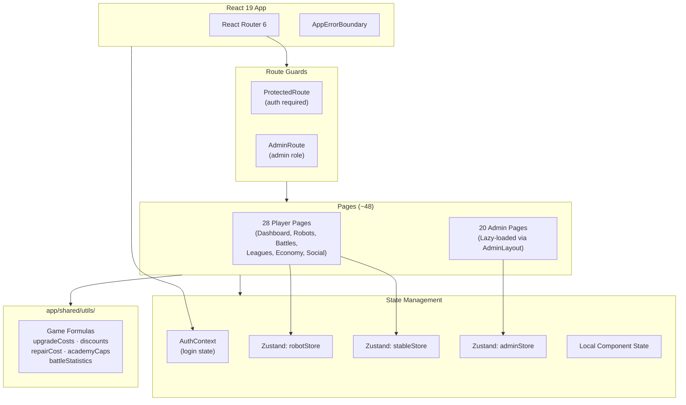

## 8. Data Model — Summary (Key Entities)

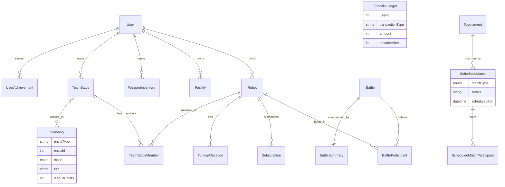

## 9. Complete Database Model (All Entities)

### 9a. Player & Robot Domain

```mermaid
erDiagram
    User {
        int id PK
        string username UK
        string email UK
        string passwordHash
        string role
        int currency
        int prestige
        int championshipTitles
        int championshipTitles1v1
        int championshipTitles2v2
        int championshipTitles3v3
        string stableName UK
        string profileVisibility
        boolean notificationsBattle
        boolean notificationsLeague
        string themePreference
        int tokenVersion
        boolean hasCompletedOnboarding
        boolean onboardingSkipped
        int onboardingStep
        string onboardingStrategy
        json onboardingChoices
        datetime onboardingStartedAt
        datetime onboardingCompletedAt
        datetime lastSeenChangelog
        json pinnedAchievements
        int totalPracticeBattles
        datetime lastLoginAt
        datetime createdAt
        datetime updatedAt
    }

    Robot {
        int id PK
        int userId FK
        string name UK
        int frameId
        string paintJob
        decimal combatPower
        decimal targetingSystems
        decimal criticalSystems
        decimal penetration
        decimal weaponControl
        decimal attackSpeed
        decimal armorPlating
        decimal shieldCapacity
        decimal evasionThrusters
        decimal damageDampeners
        decimal counterProtocols
        decimal hullIntegrity
        decimal servoMotors
        decimal gyroStabilizers
        decimal hydraulicSystems
        decimal powerCore
        decimal combatAlgorithms
        decimal threatAnalysis
        decimal adaptiveAI
        decimal logicCores
        decimal syncProtocols
        decimal supportSystems
        decimal formationTactics
        int currentHP
        int maxHP
        int currentShield
        int maxShield
        int damageTaken
        int elo
        int totalBattles
        int wins
        int draws
        int losses
        int damageDealtLifetime
        int damageTakenLifetime
        int kills
        int fame
        string titles
        int offensiveWins
        int defensiveWins
        int balancedWins
        int dualWieldWins
        int grandMeleeWins
        int grandMeleeTop3
        int repairCost
        int battleReadiness
        int totalRepairsPaid
        int yieldThreshold
        string loadoutType
        string stance
        int mainWeaponId FK
        int offhandWeaponId FK
        string imageUrl
        datetime createdAt
        datetime updatedAt
    }

    Facility {
        int id PK
        int userId FK
        string facilityType
        int level
        int maxLevel
        string activeCoach
        datetime createdAt
        datetime updatedAt
    }

    TuningAllocation {
        int id PK
        int robotId FK_UK
        decimal combatPower
        decimal targetingSystems
        decimal criticalSystems
        decimal penetration
        decimal weaponControl
        decimal attackSpeed
        decimal armorPlating
        decimal shieldCapacity
        decimal evasionThrusters
        decimal damageDampeners
        decimal counterProtocols
        decimal hullIntegrity
        decimal servoMotors
        decimal gyroStabilizers
        decimal hydraulicSystems
        decimal powerCore
        decimal combatAlgorithms
        decimal threatAnalysis
        decimal adaptiveAI
        decimal logicCores
        decimal syncProtocols
        decimal supportSystems
        decimal formationTactics
        datetime createdAt
        datetime updatedAt
    }

    User ||--o{ Robot : "owns"
    User ||--o{ Facility : "owns"
    Robot ||--o| TuningAllocation : "has"
```

### 9b. Weapon Domain

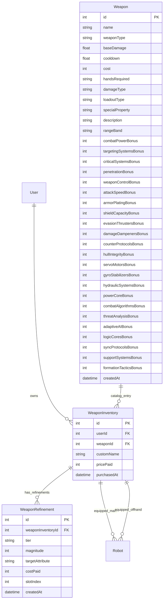

### 9c. Battle Domain

```mermaid
erDiagram
    Battle {
        int id PK
        int winnerId
        string battleType
        string leagueType
        string leagueInstanceId
        int tournamentId FK
        int tournamentRound
        json battleLog "nullable - NULLed after 7d"
        int winningSide
        int durationSeconds
        int winnerReward
        int loserReward
        datetime createdAt
    }

    BattleParticipant {
        int id PK
        int battleId FK
        int robotId FK
        int team
        string role
        int placement
        int credits
        int streamingRevenue
        int eloBefore
        int eloAfter
        int prestigeAwarded
        int fameAwarded
        int damageDealt
        int finalHP
        boolean yielded
        boolean destroyed
        bigint tagOutTimeMs
        datetime createdAt
    }

    BattleSummary {
        int id PK
        int battleId FK_UK
        json perRobot
        json perTeam
        json damageFlows
        json participants
        json kothPlacements
        json kothData
        json startingPositions
        json endingPositions
        float arenaRadius
        int battleDuration
        int totalEvents
        boolean hasData
        datetime createdAt
    }

    Battle ||--o{ BattleParticipant : "has_participants"
    Battle ||--o| BattleSummary : "summarized_by"
    Robot ||--o{ BattleParticipant : "fights_in"
    Tournament ||--o{ Battle : "contains_battles"
```

### 9d. Scheduling Domain (Unified — Spec #40)

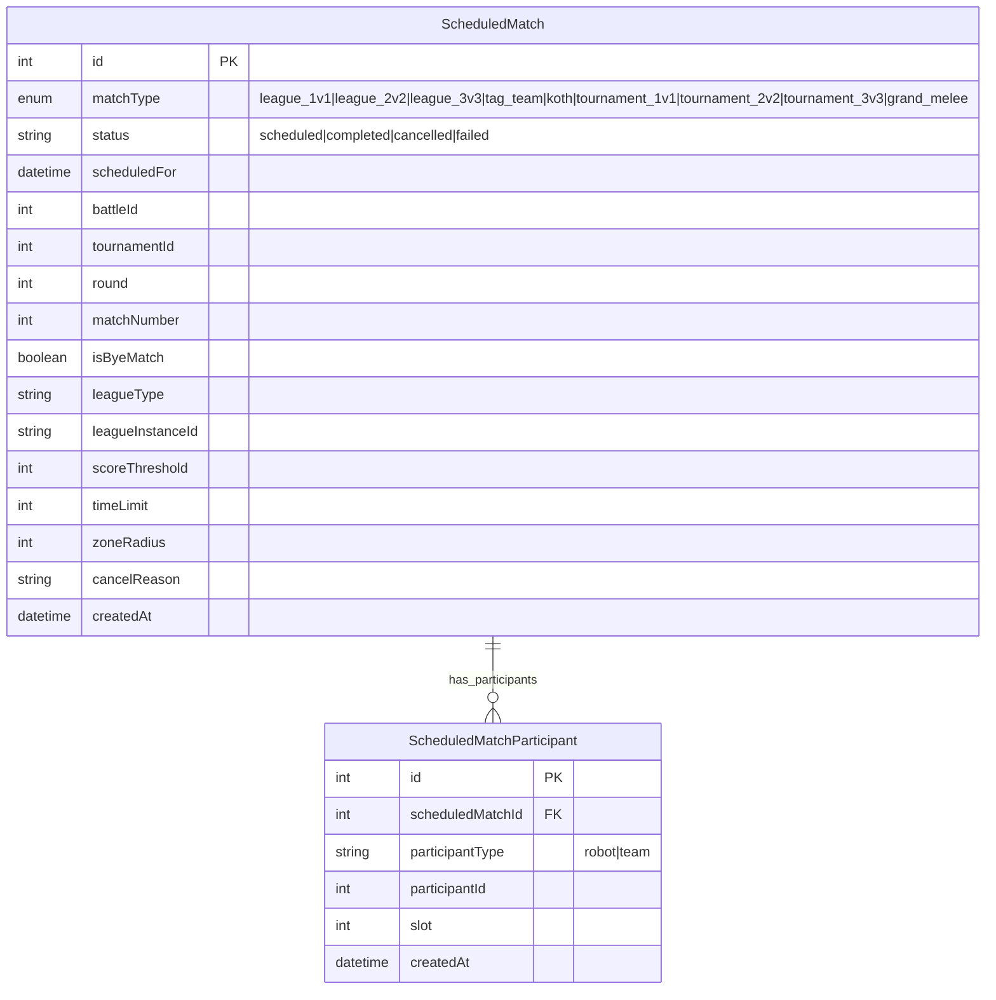

### 9e. Tournament Domain

```mermaid
erDiagram
    Tournament {
        int id PK
        string name
        string tournamentType "single_elimination|double_elimination|swiss"
        string participantType "robot|team_2v2|team_3v3"
        string status "pending|active|completed"
        int currentRound
        int maxRounds
        int totalParticipants
        int winnerId
        datetime createdAt
        datetime startedAt
        datetime completedAt
    }

    ScheduledTournamentMatch {
        int id PK
        int tournamentId FK
        int round
        int matchNumber
        string participantType "robot|team_2v2|team_3v3"
        int participant1Id
        int participant2Id
        int winnerId
        int battleId FK_UK
        string status "pending|scheduled|completed"
        boolean isByeMatch
        datetime createdAt
        datetime completedAt
    }

    Tournament ||--o{ ScheduledTournamentMatch : "has_matches"
    Battle ||--o| ScheduledTournamentMatch : "resolved_by"
```

### 9f. Team Battle Domain

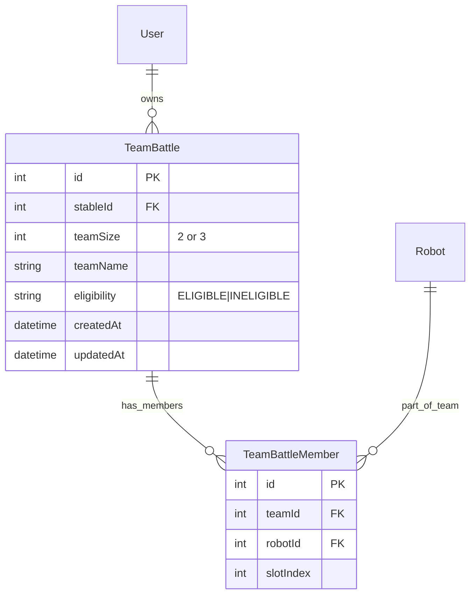

### 9g. Competitive Standings (Unified — Spec #40)

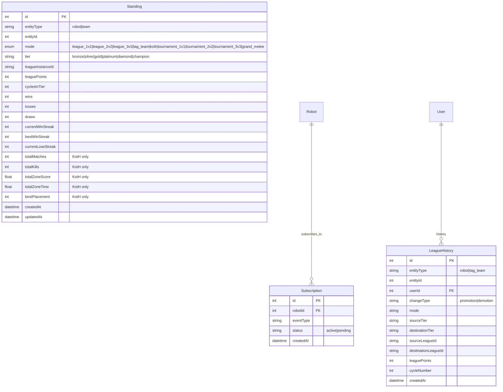

### 9h. Economy & Analytics Domain

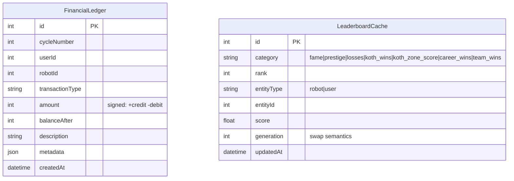

### 9i. Cycle & Audit Domain

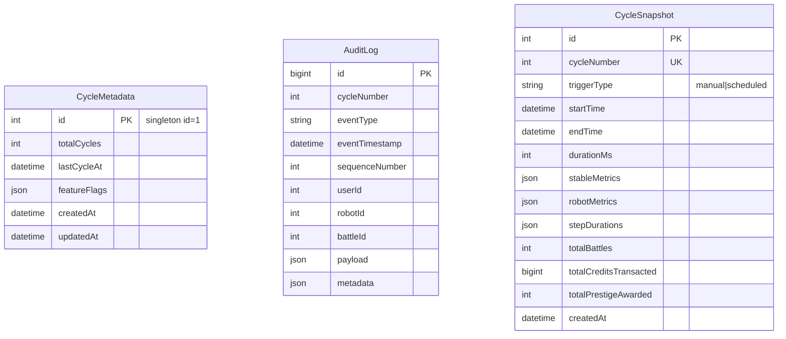

### 9j. Supporting Models

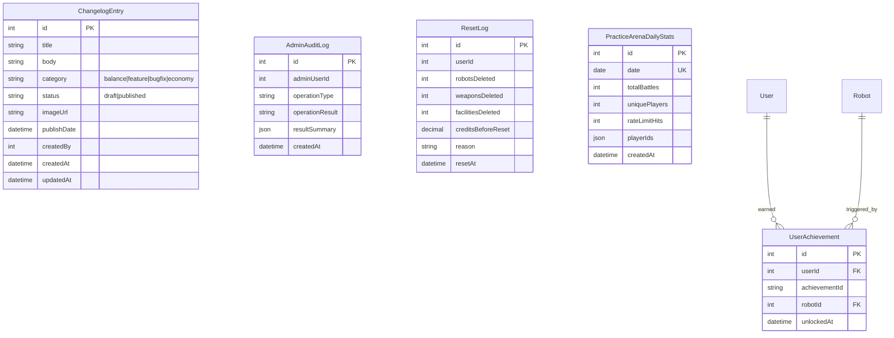

### 9k. Full Relationship Map (All FK Connections)

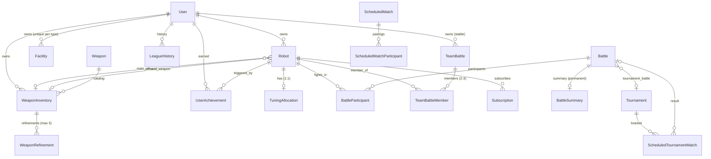

## 10. Deployment Pipeline

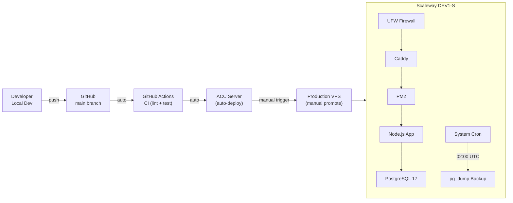

## 11. Monitoring & Alerting

```mermaid
flowchart TB
    subgraph Probes["External Probes"]
        UR["UptimeRobot<br/>(HTTP checks)"]
    end

    subgraph App["Application"]
        Health["/api/health endpoint"]
        SecMon["Security Monitor<br/>(rate limits, auth failures)"]
        CycleMon["Cycle Performance<br/>Monitor"]
        DiskCheck["Disk Usage Check<br/>(15-min cooldown alerts)"]
    end

    subgraph Alerts["Discord Webhooks"]
        DiskAlert["🚨 Disk Critical"]
        StartupFail["❌ Startup Self-Test Failed"]
        BackupFail["⚠️ Backup Failed"]
        DailyReport["📊 Daily Health Report"]
    end

    UR --> Health
    Health --> DiskCheck
    DiskCheck -->|>85%| DiskAlert
    App -->|startup failure| StartupFail
    App -->|backup cron fail| BackupFail
    CycleMon -->|daily 00:30| DailyReport
```
