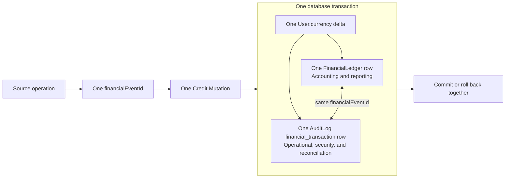

# Financial Ledger and Audit Guide

**Status**: Spec #53 deployed capture contract plus Spec #54 report-consumer contract
**Scope**: Financial capture, audit pairing, report reconciliation, canonical cycle closure, and legacy-history compatibility
**Related work**: Finance Center at `/income`; [Finance Center Reporting Contract](../implementation_notes/finance-center-reporting-contract.md)

This guide documents both sides of the financial evidence boundary. Spec #53’s capture contract and Spec #54’s Finance Center read/cutover contract are implemented without an ACC-specific activation, cycle selection, or post-deploy command. Neither contract changes reward/repair arithmetic or reconstructs historical records.

## 1. Balance and record model

The player-facing currency is Credits. The authoritative mutable balance is the exact Prisma field `User.currency`; do not document or implement a parallel `User.credits` field. `User.prestige` is a separate stable-level progression value and is never part of a credit amount.

A deployed `Credit_Mutation` has one identity and one atomic persistence unit:

```text
source operation
  -> financialEventId
  -> Credit_Mutation_Service
       -> lock and re-read User.currency
       -> update User.currency
       -> insert one FinancialLedger row
       -> insert one AuditLog row with eventType = financial_transaction
  -> commit once
```

The `FinancialLedger` row and the paired `AuditLog` row are two records for one mutation, not two mutations:

| Record | Purpose | What it answers |
|---|---|---|
| `FinancialLedger` mapped to `financial_ledger` | Accounting and reporting | What amount was applied, to which stable/robot, under which `transactionType`, and what was the resulting balance? |
| `AuditLog` mapped to `audit_logs`, with `eventType` `financial_transaction` | Immutable operational, security, and reconciliation trail | Which source produced the accounting event, when was it sequenced, and can the pair be proven complete? |

Both records carry the same non-null `financialEventId`, signed `amount`, `balanceAfter`, stable/user identity, optional robot identity, source description, and typed financial facts. The audit record never performs another `User.currency` update. The pair is written in one database transaction and receives one audit sequence through `withAuditSequence`.

### One mutation, two complementary records



The diagram's three writes are one `Credit_Mutation`, not three independent events: the balance is mutable state, while the ledger and audit rows are complementary immutable evidence of that same mutation.

Rows written before the deployed paired writer may have no financial identity. They remain immutable `Legacy_Record` history and are not used to claim paired coverage or to invent missing pairs.

## 2. Closed transaction taxonomy

The deployed `Transaction_Taxonomy` contains exactly these twelve `transactionType` values:

| `transactionType` | Sign | Source and meaning |
|---|---:|---|
| `battle_income` | positive | Fought-battle reward or a `Bye_Event` participation floor |
| `streaming_revenue` | positive | Per-robot Streaming Studio reward from a fought battle |
| `repair_cost` | negative | `Manual_Repair`, `Automatic_Repair`, or charged admin maintenance |
| `facility_upgrade` | negative | Facility purchase or upgrade charge |
| `weapon_purchase` | negative | Weapon purchase charge |
| `weapon_sale` | positive | Weapon sale proceeds |
| `weapon_refinement` | negative | Weapon refinement charge |
| `robot_creation` | negative | Robot creation charge |
| `attribute_upgrade` | negative | Attribute upgrade charge |
| `achievement_reward` | positive | Achievement credit reward |
| `passive_income` | positive | Gross settlement passive income |
| `operating_costs` | negative | Gross settlement operating costs |

New writers must reject `subscription_cost`, `prestige_award`, and `settlement_adjustment`. These names may exist in surviving legacy rows, but they are not valid deployed writes:

- `Subscription_Change` is free Booking Office state, not a charge.
- `Prestige_Award` is progression, not currency.
- Settlement is two component events, not a signed net adjustment.

## 3. Financial_Breakdown contract

Every financial event persists a typed and runtime-validated `Financial_Breakdown` in the ledger’s structured metadata and the paired audit payload. It is a record of the facts applied at the time of the event, not an instruction to recalculate the event later.

Every breakdown includes:

- formula identifier and version;
- source operation and `financialEventId`;
- typed inputs with units and source labels;
- amount-affecting modifiers, discounts, bonuses, or facility effects;
- operation order when multiple modifiers are applied;
- precision, rounding mode, and per-item versus aggregate rounding; and
- the final signed amount.

The source-specific facts are:

| Source | Required stored facts |
|---|---|
| `battle_income` | Mode, tier, outcome, placement, participation floor, win component, team size, stable aggregation, bye flag, modifiers, and final rounding |
| `streaming_revenue` | Robot, mode, base amount, battle-count multiplier, fame multiplier, Streaming Studio multiplier, eligibility, and rounding |
| `repair_cost` | Robot, `repairType`, base quote inputs, damage/condition inputs, Repair Bay level, active-robot count, Repair Bay discount, manual discount where applicable, per-robot charge, and rounding order |
| Purchases/upgrades/sales/refinements | Item or facility, previous/new level or condition, base price, discounts, roster/ownership inputs, operation identity, and rounding |
| `achievement_reward` | Achievement/unlock identity, base reward, applied modifiers, and final reward |
| `passive_income` | Cycle, Merchandising Hub level, prestige, roster capacity, prestige-per-slot normalization, facility effect, and rounding |
| `operating_costs` | Cycle, each facility and roster component, inputs, discounts/waivers, and aggregate rounding |

Combat-only values that do not affect a credit amount do not belong in the financial breakdown. A later report must explain a stored amount without reading current facilities, `User.prestige`, current robot fame, `robots.repairQuoteCredits`, or current formula code.

Example shape for a battle-income event:

```json
{
  "schemaVersion": 1,
  "formula": "battle-income-v1",
  "source": "league_1v1",
  "financialEventId": "battle:4821:stable:17:battle_income",
  "inputs": [
    { "name": "tier", "value": "gold", "unit": "tier", "source": "standing" },
    { "name": "participationFloor", "value": 6000, "unit": "credits", "source": "reward calculation" },
    { "name": "teamSize", "value": 1, "unit": "robots", "source": "battle result" }
  ],
  "modifiers": [],
  "rounding": { "precision": 0, "mode": "round", "order": "aggregate_then_round" },
  "finalAmount": 6000
}
```

## 4. Event identity, atomicity, and retries

`financialEventId` is supplied at the source boundary and must remain stable across retries. It must not be generated from the current balance, current facility state, current repair quote, or a retry timestamp.

| Source | Identity components |
|---|---|
| Battle reward | Source battle/match, receiving stable, and reward component (`battle_income` or bye component) |
| Streaming | Source battle/match, participating robot, and `streaming_revenue` |
| Achievement | Unlock identity, stable, and `achievement_reward` |
| Repair | Repair operation, repaired robot, and `repair_cost` |
| Settlement | Stable, cycle, and component (`passive_income` or `operating_costs`) |
| Request-driven economy | Durable operation identity or persisted request idempotency key |

An identical retry returns the original `balanceAfter` and creates no second balance delta or pair. A conflicting reuse of the identity fails closed if any immutable fact differs, including amount, user, robot, taxonomy, source, or breakdown. A concurrent unique-constraint race is resolved by rereading the committed event; the losing request must not apply money again.

The atomicity rule is strict:

1. validate the taxonomy, metadata, and breakdown;
2. lock/re-read `User.currency` when the mutation can race;
3. compare an existing identity before applying a new delta;
4. update `User.currency`;
5. allocate `sequenceNumber` through `withAuditSequence`;
6. insert `FinancialLedger` and the paired `financial_transaction` `AuditLog` row; and
7. commit only when all required writes succeed.

A balance update without both required records is a failed transaction, not a successful partial result. No best-effort ledger helper or financial feature flag may suppress a required write failure.

## 5. Battle rewards and row fan-out

All nine scheduled modes use the shared `Battle_Financial_Reward_Service` and `Credit_Mutation_Service` after each mode has calculated its existing reward components:

- `league_1v1`
- `tournament_1v1`
- `tag_team`
- `koth`
- `league_2v2`
- `league_3v3`
- `tournament_2v2`
- `tournament_3v3`
- `grand_melee`

A fought battle has this contract:

- aggregate battle credits by receiving stable, then write one `battle_income` pair per stable;
- write one `streaming_revenue` pair per eligible participating robot;
- send positive stable-level prestige to `Prestige_Service`; and
- retain existing `battle_complete` and `BattleParticipant` fields for display and compatibility only.

### Worked row counts

Two robots from two different stables fight a 1v1 and both are streaming-eligible:

| New record | Count |
|---|---:|
| `FinancialLedger` `battle_income` rows | 2 |
| `FinancialLedger` `streaming_revenue` rows | 2 |
| Paired `financial_transaction` `AuditLog` rows | 4 |
| Credit mutations | 4 |

Each of the four mutations has one ledger row and one paired audit row. The eight stored financial records do not represent eight balance changes.

A 2v2 whose two robots belong to one stable produces one aggregated `battle_income` pair and two `streaming_revenue` pairs. A 2v2 with two receiving stables produces one income pair per stable. Streaming is per eligible robot; battle income is per receiving stable.

### Bye_Event

A `Bye_Event` is detected before the absent side is loaded or fabricated and before any combat simulation. Its reward path writes only the existing participation-floor `battle_income` pair. It writes no streaming revenue, prestige, fame, draw, repair spend, or simulated combat result.

A byed robot can still require `Automatic_Repair` before the scheduled event if it has pre-existing damage. That repair is resolved by the normal event schedule scope and creates its own per-robot `repair_cost` pair and `robot_repair` domain record. It is not part of, or attributed to, the bye reward. This distinction prevents a bye reward from being mistaken for a repair charge while ensuring a scheduled robot is not exempted from normal pre-battle repair.

## 6. Repair accounting

The arithmetic authority remains the shared module `app/shared/utils/repairCost.ts`:

- `calculateRepairQuote` produces the Repair_Quote after the Repair Bay discount;
- `applyManualRepairDiscount` applies the manual discount to that quote; and
- `calculateRepairBayDiscountPercent` records the Repair Bay effect.

No caller duplicates the formula or reapplies a discount already present in the quote.

`Manual_Repair`, `Automatic_Repair`, and charged admin maintenance use `repair_cost` with `repairType` exactly `manual` or `automatic`. Every repaired robot receives:

1. one `repair_cost` `FinancialLedger`/`financial_transaction` pair; and
2. one `AuditLog` `robot_repair` domain record.

The subtype-bearing `robot_repair` record is the `Repair_Spend` `Canonical_Source` for the dashboard and admin repair log. Its payload carries `creditsCharged`, `repairType`, `manualRepairDiscount`, and, on manual events, `creditsBeforeManualDiscount`. The financial pair supports accounting and reconciliation but does not replace the subtype-bearing repair source for repair reports.

A manual batch is expanded per robot: quote, apply the Repair Bay discount, apply the manual discount, round, create the per-robot records, then sum. The sum must equal the `User.currency` delta, `robots.lifetimeRepairCreditsPaid`, financial amounts, and repair audit totals. A failed pair rolls back the charge; an identical retry cannot charge the robot again.

Repair spend must never be read from:

- `battle_complete` payloads, including a missing or historical `repairCost` key;
- `robots.repairQuoteCredits`, which is a forward-looking quote and not money spent; or
- a net or subtype-losing ledger aggregation when the question is manual versus automatic spend.

## 7. Prestige records and growth history

Prestige is a stable-level progression resource. `Prestige_Service` is separate from `Credit_Mutation_Service` and writes positive awards as `AuditLog` rows with `eventType` `prestige_change`.

Each deployed prestige record includes:

- `sourceEventId`, unique for the source award;
- `eventTimestamp` and `cycleNumber`;
- stable/user identity;
- exact aggregate award amount;
- source `battle` or `achievement`;
- optional mode, battle, or achievement identity;
- typed award breakdown; and
- resulting `User.prestige`.

Team, placement, KotH, Grand Melee, and tournament rewards aggregate at stable level before calling `Prestige_Service`. Participant payload fields are context/display data and are not summed later to reconstruct the canonical amount.

An identical `sourceEventId` retry returns the original prestige result. Reusing it with different facts fails closed and does not alter `User.prestige`. `withAuditSequence` orders records for a current-season `Prestige_Growth_Series`; no credit ledger row is written for prestige. Bye outcomes, zero awards, account resets, and `Season_Rollover` do not create positive prestige records.

## 8. Settlement and zero-valued components

`Settlement_Service` is the sole mutating settlement implementation used by `cycleScheduler.ts`, `adminCycleService.ts`, and the supported administrative daily-finance trigger. For every applicable stable and `cycleNumber`, it writes:

1. exactly one `passive_income` pair; and
2. exactly one `operating_costs` pair.

This includes zero-valued components. A zero component records a completed calculation, typed inputs, and unchanged `balanceAfter`; it is not an additional credit delta. Rerunning a stable/cycle is idempotent and cannot pay or charge twice. Partial failure rolls back the component and its balance mutation.

`passive_income` stores gross passive income and its Merchandising Hub, prestige, roster-capacity, and rounding facts. `operating_costs` stores each facility/roster cost component and its inputs. Per-battle Streaming Studio revenue remains `streaming_revenue`, not settlement income.

Existing domain `passive_income` and `operating_costs` audit events and cycle snapshot fields remain compatible while identified paired `financial_transaction` rows provide the accounting source. A future report may derive a net value from the two components; it must not create or expect `settlement_adjustment`.

## 9. Canonical-source map

| Reporting or operational question | `Canonical_Source` |
|---|---|
| Deployed paired-capture credit amount, balance, taxonomy, breakdown, or pair | `FinancialLedger` plus paired `AuditLog` `financial_transaction`, joined by `financialEventId` |
| Reconciled signed repair movement | Complete `repair_cost` `FinancialLedger` plus paired `financial_transaction`; count the ledger amount once |
| Repair spend display, count and `repairType` | Linked `AuditLog` `robot_repair` row with `creditsCharged` and `repairType`, after `sourceEventId`/owner/robot/period/amount validation |
| Prestige awards and current-season growth points | `AuditLog` `prestige_change` rows with `sourceEventId` |
| Subscription state and changes | Booking Office records and existing subscription audit records |
| Account creation, reset, rollover, and archive history | Existing lifecycle/audit and archive records |
| Battle display/result history | Existing `battle_complete`, `BattleParticipant`, and permanent battle-summary records |

No report should substitute a battle payload, cached quote, current formula, or subtype-losing aggregate for the source that answers its question.

## 10. Admin compatibility

The financial capture change preserves existing admin contracts while adding generic visibility for the new audit event:

- `/api/admin/audit-log` continues to expose its existing filters and response shape and can query `financial_transaction` rows.
- `/api/admin/audit-log/repairs` remains scoped to subtype-bearing `robot_repair` records and keeps `repairType`, `creditsCharged`, and manual-discount fields available.
- `/api/admin/daily-finances/process` remains available. Its response continues to include `summary.totalCostsDeducted`, `usersProcessed`, and `timestamp`; mutation delegates to `Settlement_Service` or the endpoint is a non-mutating preview.
- `/api/admin/cycles/bulk` preserves `includeDailyFinances`, `settlement.finances`, `totalPassiveIncome`, `totalOperatingCosts`, `usersProcessed`, and `skipped` while delegating settlement mutation.
- `/api/admin/economy/overview` preserves the response fields and filters consumed by `EconomyOverviewPage`.

`CycleControlsPage`, `RepairLogPage`, `AuditLogPage`, and `EconomyOverviewPage` require no redesign. Generic financial audit rows are visible through the existing audit route; the repair route remains a repair-domain view rather than a generic ledger view.

## 11. Deployment behavior and reconciliation

The normal backend deployment is the activation point. Deploy the existing nullable identity migration and this backend version together; every new current-economy mutation then uses the required atomic writer immediately. There is no feature flag, cycle gate, command, startup write, or aftercare procedure.

Reconciliation is read-only. It validates identified paired evidence and reports ledger/audit pair gaps, duplicate or conflicting identities, mismatched facts or balances, invalid taxonomy/breakdowns, repair-domain mismatches, settlement component defects, prestige-source defects, and direct `User.currency` writers outside the shared service. Historical null-identity rows are retained as legacy history and excluded rather than rewritten or reconstructed.

### Failure response

If a required paired write fails, the enclosing transaction fails: verify that `User.currency` rolled back, inspect the identity or sequence error, and retry only with the same immutable source facts. Never create a compensating ledger row, add a second balance adjustment, or alter historical evidence.

## 12. Finance Center report-consumer contract (Spec #54)

The Finance Center is the implemented player report consumer of the capture contract above. Its version 1 API and UI behavior, cutover details, and verification evidence are maintained in [`finance-center-reporting-contract.md`](../implementation_notes/finance-center-reporting-contract.md). The named report concepts are Revenue_Growth, Full_Damage_Repair_Reference, Prestige_Milestone_Forecast, and Robot_Deployment_View.

### Canonical cycle ownership and closure

Under Spec #54, `CycleMetadata.totalCycles` is the completed financial-cycle count and active cycle is `totalCycles + 1`. Financial Cycle 1 starts at the retained Season Rollover instant, remains active through both preparation days and the first competitive/match day, contains preparation spending and achievement Credit rewards, and closes only at the first competitive settlement. Preparation midnights do not settle, close, or renumber it.

Scheduled and admin closure use one Serialized Cycle Cutover. Once closing balance capture starts, no current-economy writer may commit to that cycle. Settlement writes paired `passive_income` and `operating_costs` (including zero values), then `cycle_end_balance`, `cycle_complete`, and `CycleSnapshot`, and advances the completed count last. A blocked writer resumes after advancement and resolves the next active cycle. The canonical cutover service and scheduled/admin race tests enforce this ordering.

### Consistent report read and sequence order

Every version 1 success envelope is assembled from one database-consistent read view and exposes one server `asOf`. Ledger rows, paired/domain audits, boundaries, snapshots, and Current Cycle `User.currency` confirmation in that envelope all come from that same cutoff.

A report selects only complete non-null-identity financial pairs and orders them by paired audit `(cycleNumber, sequenceNumber)`. Sequence numbers restart per cycle, so timestamp order and a bare sequence number are invalid for a range. It derives opening from the earliest ordered `balanceAfter - amount`, signed movement by counting each ledger amount once, and closing from the final ordered `balanceAfter`. It proves:

```text
opening + signed movement = closing
opening + earned Credits + investment proceeds - running costs - investment purchases = closing
```

For every completed cycle in a selection, derived closing is checked against that cycle’s `cycle_end_balance` and snapshot stable balance. These are boundary checks, not financial lines. `User.currency` confirms Current Cycle only and never repairs a historical gap.

Null-identity legacy rows, missing pairs or boundaries, snapshot/end-balance disagreement, administrative anomalies, and inconsistent cycle identity produce typed non-monetary limitations. They are not reconstructed from timestamps, current state, current formulas, or snapshot aggregates.

### Classification and stored facts

Earned Credits consist only of `battle_income`, `streaming_revenue`, `passive_income`, and `achievement_reward`. Positive `weapon_sale` is investment proceeds, not earned revenue and not negative purchase spend. Robot creation, facilities, weapons, Weapon Refinement, and attributes are investment purchases. Prestige remains nonfinancial.

Operating-cost itemisation reads the stored `operating_costs` Financial_Breakdown written at settlement. It never recomputes historical components from current facility levels. Zero-valued settlement rows make a modern no-activity cycle explicit.

### Repair single-contribution rule

The phrase “`robot_repair` is the repair-spend canonical source” answers the domain question: what was charged manually or automatically, to which robot, and how many times? Finance Statement cash reconciliation still includes the linked signed `repair_cost` ledger amount exactly once.

The join requires `robot_repair.sourceEventId === financialEventId`, equal stable, robot, period and subtype, and `creditsCharged === abs(ledger.amount)`. The domain row supplies positive amount/subtype/count for display; it is never added as another movement. A mismatch produces `repair_link_mismatch`. `repairQuoteCredits` remains estimate-only.

### Battle allocation evidence

`BattleParticipant.credits` is persisted per-robot battle/bye allocation evidence. Since team, tag-team, placement and bye ledger awards may be stable-aggregated, a report joins participants to the related complete `battle_income` record, restricts participants to robots owned by the ledger stable, and verifies their sum equals that stable’s award before exposing per-robot amounts. It does not require every ledger row to carry `robotId`, divide stable awards, or include an opposing stable’s allocation. Failure produces `battle_allocation_mismatch` and excludes unsupported attribution.

### Public response boundary

Finance Center uses versioned authenticated envelopes. Version `1` means response-schema compatibility, not season. Stable identity comes from JWT; robot detail is ownership-checked and returns generic `403 Access denied` for absent/non-owned IDs.

Raw `financialEventId`, audit IDs/payloads, security payloads, tokens and unnecessary internal IDs never enter player responses, caches, or diagnostics. The report boundary replaces internal source identity with an opaque Player-Safe Source Reference that is stable across refreshes/pages, collision-free within authenticated stable and active season, non-reversible, display/log safe, and never authorization. `FINANCE_REPORT_REFERENCE_SECRET` supplies its independent HMAC key in production; the reporting contract records the implementation and key-lifecycle boundary.

### Season and cache boundary

Live Finance Center ranges are active-season only. Season Rollover purges live ledger, audit, snapshot, battle, and analytics evidence; cross-season facts come only from archive tables and are not reconstructed into a live statement.

Cache keys include authenticated stable, active season, exact normalized period, resource, and page/page-size/order where applicable. Only sanitized envelopes may be cached. Current-inclusive entries retain their original `asOf` and use a short TTL; completed history may be immutable. Exact TTL/invalidation and the database read mechanism are implementation evidence recorded in the reporting contract rather than invented here.

## 13. Release verification

The normal blocking release checks remain required: lint, build, test typecheck/tier verification, backend unit/integration/heavy tests, frontend lint/build/unit tests, and E2E. Finance Center adds blocking coverage for canonical preparation Cycle 1, serialized scheduled/admin cutover races, one-cutoff sequence reconciliation, sale polarity, stored facility itemisation, repair linkage, battle-allocation conservation, source-reference security, cache isolation, pagination invariance, performance budgets, local time, and responsive/keyboard behavior.

No test may be retired until its named replacement contract coverage passes. No `continue-on-error`, `|| true`, unguarded pipe, or advisory bypass is acceptable.

## 14. Scope boundary and references

Spec #53’s deployed capture contract remains unchanged by the reporting work. Spec #54 changes the player report, navigation, cycle ownership/cutover, and read model; it does not change Credit amounts, repair/reward formulas, the closed taxonomy, prestige gates, subscriptions, teams, or facility arithmetic. Historical rows are never backfilled or relabelled.

For the page/API/limitations/migration/test record, see:

- [`finance-center-reporting-contract.md`](../implementation_notes/finance-center-reporting-contract.md)
- [`PRD_INCOME_DASHBOARD.md`](../prd_pages/PRD_INCOME_DASHBOARD.md)
- [`PRD_ECONOMY_SYSTEM.md`](../game-systems/PRD_ECONOMY_SYSTEM.md)
- [`PRD_CYCLE_SYSTEM.md`](../game-systems/PRD_CYCLE_SYSTEM.md)
- [`PRD_AUDIT_SYSTEM.md`](../architecture/PRD_AUDIT_SYSTEM.md)
- [`PRD_SEASON_SYSTEM.md`](../game-systems/PRD_SEASON_SYSTEM.md)
