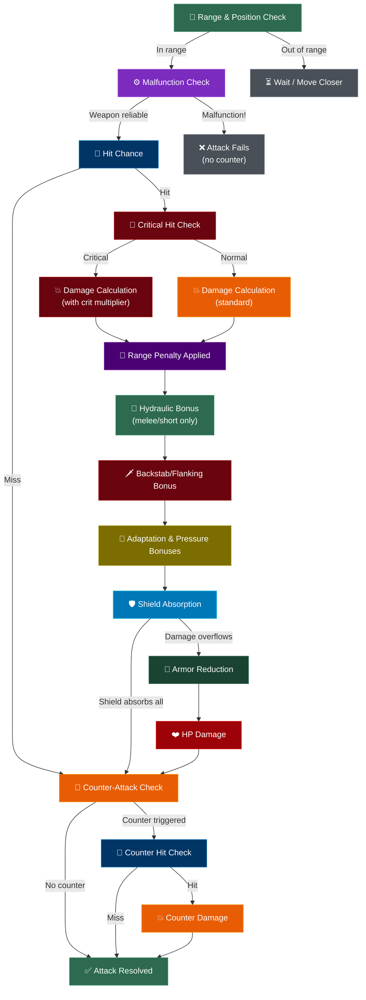

## Overview

Battles in Armoured Souls take place in a **2D circular arena** where robots move, position, and fight in real-time. You don't control your robots directly — the combat simulator resolves everything automatically based on your robot's attributes, weapons, stance, and loadout. Understanding the flow helps you understand *why* a battle played out the way it did.

Each battle tick, robots move toward their preferred range, check facing direction, and attempt attacks when their weapons are ready. Every attack follows a strict sequence of checks and calculations.


## The Battle Loop

Every simulation tick, the following happens for each robot:

1. **Movement** — Robots move toward their preferred range based on weapon type and AI decisions
2. **Facing Update** — Robots turn to face their opponent, limited by turn speed (Gyro Stabilizers + Threat Analysis)
3. **Range Check** — The distance between robots determines the current range band and whether weapons can fire
4. **Attack Resolution** — If a weapon is off cooldown and in range, the attack sequence begins

## Range Bands

Distance between robots determines the **range band**, which affects damage through range penalties:

| Range Band | Distance | Examples |
|-----------|----------|----------|
| **Melee** | 0–2 units | Melee weapons, shields |
| **Short** | 3–6 units | One-handed energy/ballistic weapons |
| **Mid** | 7–12 units | Two-handed ranged weapons (Shotgun, Plasma Cannon) |
| **Long** | 13+ units | Sniper Rifle, Railgun, Ion Beam |

Each weapon has an **optimal range band**. Fighting at the right distance matters:

| Situation | Damage Multiplier |
|-----------|------------------|
| At optimal range | 1.1× (+10% bonus) |
| One band away | 0.75× (-25% penalty) |
| Two or more bands away | 0.5× (-50% penalty) |

Melee weapons cannot attack at all beyond 2 units. Your robot must close the distance first.

```callout-tip
Range management is one of the most impactful aspects of combat. A sniper at long range deals 1.1× damage, but if a melee robot closes to melee range, that same sniper deals only 0.5× while the melee robot gets 1.1× plus Hydraulic Systems bonuses. Servo Motors determines who controls the distance.
```

## Backstab & Flanking

Positioning behind your opponent grants bonus damage:

- **Backstab**: When the attacker is more than 120° from the defender's facing direction, the attack deals up to +10% bonus damage
- The defender's **Gyro Stabilizers** reduces the backstab bonus (0.25% reduction per point)
- The defender's **Threat Analysis** further reduces it at high levels (25+): 1% reduction per point above 25
- **Flanking** (multi-robot battles): When 2+ attackers are more than 90° apart relative to the defender, a +20% flanking bonus applies (also reduced by Gyro Stabilizers and Threat Analysis)

## The Attack Sequence

Once a weapon is ready and in range, each attack follows this sequence:



## Step 1: Range & Position Check

Before attacking, the simulator checks whether the weapon can reach the opponent. Melee weapons are blocked beyond 2 grid units. Ranged weapons can fire at any distance but suffer range penalties outside their optimal band.

If the weapon can't reach, the robot continues moving toward its preferred range. The **patience timer** (controlled by Combat Algorithms) determines how long the robot waits before forcing an attack even at suboptimal range.

## Step 2: Malfunction Check

Every weapon has a base malfunction rate that decreases as your robot's **Weapon Control** attribute increases.

- At low Weapon Control, roughly 1 in 5 attacks can misfire
- At maximum Weapon Control (level 50), weapons become perfectly reliable
- If a malfunction occurs, the attack fails immediately — no damage, no counter-attack triggered

See the [Malfunctions Guide](/guide/combat/malfunctions) for details.

## Step 3: Hit Chance

If the weapon fires successfully, the game calculates whether the attack lands. Hit chance is influenced by:

- **Targeting Systems** — Your robot's primary accuracy attribute
- **Combat Algorithms** — Grants a bonus when the algorithm score is high
- **Adaptive AI** — Accumulated hit bonus from previous misses/damage taken
- **Pressure bonus** — Logic Cores grants accuracy when HP is low
- **Stance** — Offensive stance provides a small accuracy bonus
- **Evasion Thrusters** (defender) — The opponent's ability to dodge
- **Gyro Stabilizers** (defender) — The opponent's balance reduces your hit chance

Main hand attacks have higher base accuracy (70%) than offhand attacks (50%) in Dual-Wield configurations.

## Step 4: Critical Hit Check

If the attack hits, the game rolls for a critical hit:

- **Critical Systems** — The primary attribute for critical hit chance
- **Targeting Systems** — Provides a smaller secondary bonus
- **Two-Handed loadout** — Grants a meaningful crit chance bonus
- **Damage Dampeners** (defender) — Reduces the critical damage multiplier

## Step 5: Damage Calculation

Raw damage is calculated from multiple factors:

- **Weapon base damage** — Each weapon has an inherent damage value
- **Combat Power** — Primary damage-scaling attribute
- **Weapon Control** — Secondary damage multiplier
- **Range penalty** — 1.1× at optimal range, 0.75× one band away, 0.5× two+ bands away
- **Hydraulic Systems bonus** — Up to +150% at melee range, +75% at short range
- **Backstab/flanking bonus** — Up to +10% (backstab) or +20% (flanking) for positional advantage
- **Adaptation bonus** — Accumulated damage bonus from Adaptive AI
- **Pressure bonus** — Damage bonus from Logic Cores when HP is low
- **Sync volley bonus** — Sync Protocols bonus for synchronized dual-wield attacks
- **Loadout type** — Two-Handed weapons deal bonus damage; Dual-Wield deals less per hit
- **Stance** — Offensive stance boosts damage; Defensive stance reduces it

## Step 6: Shield Absorption

Damage hits the defender's **Energy Shield** first. If the shield absorbs all damage, no hull damage occurs. If damage exceeds the remaining shield, the overflow continues to armor.

Shields regenerate during battle based on **Power Core** and **Support Systems**. Defensive stance boosts regeneration by 20%.

## Step 7: Armor Reduction & HP Damage

Damage that overflows past shields passes through **Armor Plating** for percentage-based reduction. **Formation Tactics** provides additional damage reduction near the arena edge. The remaining damage is subtracted from hull HP.

If HP drops to zero, the robot is destroyed. If HP drops below the [Yield Threshold](/guide/combat/yielding-and-repair-costs), the robot surrenders.

## After the Attack: Counter-Attack Check

After any non-malfunction attack — hit or miss — the defender gets a chance to counter-attack. **Counter Protocols** determines the base chance, boosted by Defensive stance and Weapon+Shield loadout. Counter-attacks have their own range check and hit roll.

## Putting It All Together

When reviewing a battle and wondering why your robot lost, trace the flow:

- Robot not reaching the opponent? → Invest in **Servo Motors**
- Getting backstabbed? → Boost **Gyro Stabilizers** and **Threat Analysis**
- Lots of malfunctions? → Invest in **Weapon Control**
- Missing too often? → Boost **Targeting Systems** or **Combat Algorithms**
- Damage is low despite hitting? → Check your **range band** — you might be fighting at the wrong distance. Also check **Combat Power** and **Hydraulic Systems** for melee builds.
- Taking too much hull damage? → Upgrade **Armor Plating**, **Shield Capacity**, or **Damage Dampeners**
- Losing long fights? → Invest in **Adaptive AI** and **Logic Cores**

```callout-tip
The 2D battle playback viewer shows robot positions, movement, and range bands in real-time. Use it to see exactly how the spatial dynamics played out — where your robot was positioned, whether it reached optimal range, and whether backstabs occurred.
```

## What's Next?

- [Movement & Positioning](/guide/combat/movement-and-positioning) — Deep dive into the 2D arena, range bands, and spatial mechanics
- [Malfunctions](/guide/combat/malfunctions) — Weapon reliability and Weapon Control
- [Stances](/guide/combat/stances) — How Offensive, Defensive, and Balanced stances modify your stats
- [Yielding & Repair Costs](/guide/combat/yielding-and-repair-costs) — The surrender system and its economic implications
- [Counter-Attacks & Shield Regeneration](/guide/combat/counter-attacks) — Defensive mechanics between attacks


## King of the Hill Mode

In addition to standard 1v1 league battles, robots can compete in **King of the Hill** — a 5-6 robot free-for-all zone-control mode. KotH runs on the same unified combat simulator as all other match types, using the full 7-phase tick loop with all 23 attributes active. The difference is in the *game mode configuration*: KotH plugs in custom strategy objects that modify target selection, movement intent, and win conditions.

### What's shared with 1v1
All core combat mechanics apply in KotH: the full attack resolution chain (malfunction → hit → crit → damage → shield → armor → counter-attack), range bands with penalties, backstab/flanking bonuses, shield regeneration, offhand attacks for dual-wield builds, yield mechanics, adaptation (Adaptive AI), pressure system (Logic Cores), and servo strain.

### What's different in KotH
- **Target selection**: Zone contesters are prioritized 3× over standard threats. Robots approaching the zone get 2× priority. Threat Analysis scales zone awareness.
- **Movement AI**: Robots are biased toward the control zone. High Combat Algorithms robots may wait outside for opponents to weaken each other before entering.
- **Win condition**: First to reach a score threshold (30 points fixed zone, 45 rotating) or highest score at time limit. Last-standing gets a 10-second scoring window.
- **Zone scoring**: 1 point per second of uncontested zone occupation, +5 kill bonus.
- **Anti-passive penalties**: Robots that stay outside the zone too long suffer accuracy and damage reduction penalties.
- **No ELO changes**: KotH is a standalone mode with placement-based rewards.

See the [King of the Hill](/guide/king-of-the-hill/zone-control-basics) section for full details on zone control, scoring, and rewards.
