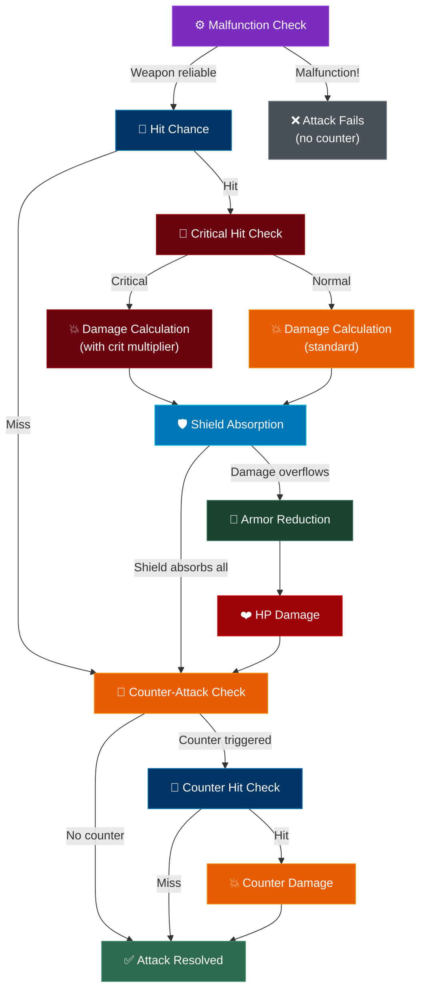

## Overview

Every attack in Armoured Souls follows a strict sequence of checks and calculations. Understanding this flow is the key to building robots that perform consistently — because each step in the chain is a place where your investment in attributes either pays off or falls short.

You don't control your robots directly in battle. The combat simulator resolves each attack automatically based on your robot's attributes, weapons, stance, and loadout. Knowing the order of operations helps you understand *why* a battle played out the way it did.


## The Attack Sequence



Here's what happens at each step.

## Step 1: Malfunction Check

Before anything else, the game checks whether the attacking weapon malfunctions. Every weapon has a base malfunction rate that decreases as your robot's **Weapon Control** attribute increases.

- At low Weapon Control, roughly 1 in 5 attacks can misfire
- At maximum Weapon Control (level 50), weapons become perfectly reliable
- If a malfunction occurs, the attack fails immediately — no damage, no critical hit, and no counter-attack is triggered (the weapon failed before any real attack happened)

This is the first gate. A malfunctioning weapon wastes your robot's turn entirely. See the [Malfunctions Guide](/guide/combat/malfunctions) for a deeper look at how Weapon Control reduces this risk.

```callout-tip
Weapon Control is often undervalued by new players. Even a modest investment dramatically reduces the chance of wasted attacks, which compounds over the course of a full battle.
```

## Step 2: Hit Chance

If the weapon fires successfully, the game calculates whether the attack actually lands. Hit chance is influenced by:

- **Targeting Systems** — Your robot's primary accuracy attribute. Higher values mean more hits.
- **Stance** — Offensive stance provides a small accuracy bonus.
- **Evasion Thrusters** (defender) — The opponent's ability to dodge reduces your hit chance.
- **Gyro Stabilizers** (defender) — The opponent's balance and reaction time also reduce your hit chance.
- **Random variance** — A small random factor adds unpredictability to each attack.

Main hand attacks have a higher base accuracy than offhand attacks in [Dual-Wield](/guide/weapons/loadout-types) configurations. Hit chance is always clamped between a minimum floor and a maximum ceiling, so no attack is ever guaranteed to hit or guaranteed to miss.

```callout-info
Even with maximum Targeting Systems, there's always a small chance to miss. Conversely, even a poorly-aimed attack has a slim chance of connecting. The randomness keeps battles unpredictable.
```

## Step 3: Critical Hit Check

If the attack hits, the game rolls for a critical hit. Critical strikes deal significantly more damage than normal attacks. Your chances improve with:

- **Critical Systems** — The primary attribute for critical hit chance.
- **Targeting Systems** — Provides a smaller secondary bonus to crit chance.
- **Two-Handed loadout** — Grants a meaningful crit chance bonus.
- **Random variance** — Adds unpredictability, just like hit chance.

Critical damage is a multiplier on your base damage. Two-Handed weapons get an even higher critical multiplier, making them the loadout of choice for crit-focused builds.

The defender's **Damage Dampeners** attribute reduces the critical damage multiplier, softening the blow. At high Damage Dampeners levels, critical hits still hurt more than normal attacks, but the spike is much less punishing.

## Step 4: Damage Calculation

Now the game calculates how much raw damage the attack deals. Several factors multiply together:

- **Weapon base damage** — Each weapon has an inherent damage value.
- **Combat Power** — Your primary damage-scaling attribute. More Combat Power means harder hits.
- **Weapon Control** — Provides a secondary damage multiplier on top of its reliability benefit.
- **Loadout type** — Two-Handed weapons deal bonus damage; Dual-Wield weapons deal slightly less per hit (but attack twice).
- **Stance** — Offensive stance boosts damage; Defensive stance reduces it. See the [Stances Guide](/guide/combat/stances).

If the attack was a critical hit, the critical multiplier is applied here, amplified by your offensive stats and reduced by the defender's Damage Dampeners.

```callout-tip
Damage Dampeners provides value on every single hit — not just criticals. It applies a small percentage-based damage reduction before shields even come into play, making it a quietly powerful defensive investment.
```

## Step 5: Shield Absorption

Damage hits the defender's **Energy Shield** first. Energy shields are a separate HP pool that sits in front of your robot's hull. All incoming damage is applied to the shield at full effectiveness.

- If the shield absorbs all the damage, the attack is fully blocked and no hull damage occurs.
- If the damage exceeds the remaining shield, the shield breaks and the overflow continues to the next step.

Energy shields regenerate during battle based on the **Power Core** attribute, and Defensive stance boosts regeneration by 20%. This means shields can recover between attacks, providing ongoing protection throughout the fight. See [Counter-Attacks & Shield Regeneration](/guide/combat/counter-attacks) for more on this.

## Step 6: Armor Reduction

Any damage that overflows past the energy shield hits the robot's hull, but first it passes through **Armor Plating**. Armor provides percentage-based damage reduction — the more armor your robot has relative to the attacker's Penetration, the less hull damage you take.

The interaction between armor and penetration creates a rock-paper-scissors dynamic:

- **High Armor vs Low Penetration** — Armor significantly reduces incoming damage. Tanky builds thrive here.
- **High Penetration vs Low Armor** — Penetration not only bypasses armor but actually *amplifies* damage beyond the base amount. Glass cannon builds with high Penetration can shred lightly-armored opponents.
- **Balanced matchup** — When armor and penetration are roughly equal, damage passes through with minimal modification.

```callout-info
There's no hard cap on armor reduction — it scales smoothly with your Armor Plating investment. But Penetration is a hard counter. A robot with high Penetration can turn your armor investment into a liability by dealing bonus damage through it.
```

## Step 7: HP Damage

After armor reduction, the final damage is subtracted from the defender's hull HP. If HP drops to zero, the robot is destroyed. If HP drops below the robot's [Yield Threshold](/guide/combat/yielding-and-repair-costs), the robot surrenders instead.

Hull HP does **not** regenerate during battle. Every point of hull damage is permanent until you pay for repairs after the fight. This is why energy shields and armor are so important — they protect the resource that costs you credits to restore.

## After the Attack: Counter-Attack Check

After any attack that isn't a malfunction — whether it hits or misses — the defender gets a chance to counter-attack. The **Counter Protocols** attribute determines the base chance, boosted by Defensive stance and the Weapon+Shield loadout.

Counter-attacks have their own hit check, so they can miss too. When they connect, they deal reduced damage compared to a normal attack but happen *in addition to* the defender's regular attack cycle. They're essentially free bonus attacks for defensive builds. See [Counter-Attacks & Shield Regeneration](/guide/combat/counter-attacks) for the full breakdown.

## Putting It All Together

Every attribute in the game connects to at least one step in this chain. When you're reviewing a battle log and wondering why your robot lost, trace the flow:

- Lots of malfunctions? → Invest in **Weapon Control**
- Missing too often? → Boost **Targeting Systems** or switch to a non-Dual-Wield loadout
- Hits landing but damage is low? → Increase **Combat Power** or try **Offensive stance**
- Taking too much hull damage? → Upgrade **Armor Plating**, **Shield Capacity**, or **Damage Dampeners**
- Opponent countering constantly? → They likely have high **Counter Protocols** and Defensive stance

```callout-tip
The battle log shows every event in sequence. Cross-reference it with this flow to diagnose exactly where your build is underperforming.
```

## What's Next?

- [Malfunctions](/guide/combat/malfunctions) — Deep dive into weapon reliability and Weapon Control
- [Stances](/guide/combat/stances) — How Offensive, Defensive, and Balanced stances modify your stats
- [Yielding & Repair Costs](/guide/combat/yielding-and-repair-costs) — The surrender system and its economic implications
- [Counter-Attacks & Shield Regeneration](/guide/combat/counter-attacks) — Defensive mechanics that happen between attacks
