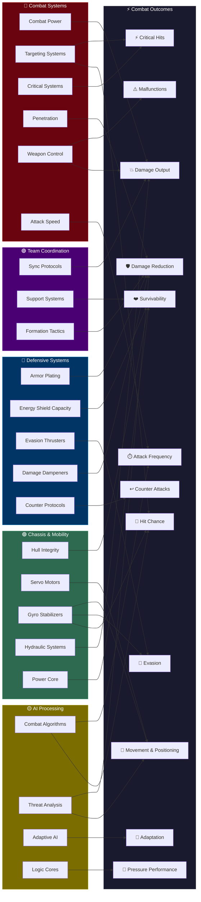

## Overview

Your robot's 23 attributes don't operate in isolation — they feed into specific combat outcomes. Understanding which attributes influence which results helps you build focused, effective robots instead of spreading upgrades too thin.

The diagram below maps each attribute category to the combat outcomes it affects.


## Attribute-to-Combat Influence Diagram



## How Each Category Influences Combat

### 🔴 Combat Systems → Damage, Accuracy, Crits, and Reliability

Combat Systems attributes are the engine behind your offensive output:

- **Combat Power** directly scales your damage on every hit
- **Targeting Systems** determines whether your attacks land at all — a missed attack deals zero damage regardless of how high your Combat Power is. Also contributes slightly to critical hit chance.
- **Critical Systems** gives you a chance to deal significantly amplified damage on any hit
- **Penetration** effectively reduces the opponent's defenses, letting more of your damage through
- **Weapon Control** has a dual role: it reduces weapon malfunction chance (at low levels, weapons misfire up to 20% of the time) and adds a secondary damage multiplier
- **Attack Speed** determines how often you attack — more attacks means more total damage over time

```callout-tip
Weapon Control is easy to overlook, but at level 1 your weapons have a 20% malfunction rate — one in five attacks just fails. Getting Weapon Control up reduces that to zero by level 50. It's one of the highest-impact early investments.
```

### 🔵 Defensive Systems → Damage Reduction, Evasion, and Counters

Defensive Systems determine how much punishment your robot can absorb:

- **Armor Plating** provides percentage-based damage reduction on every hit that reaches your hull
- **Energy Shield Capacity** creates a separate HP buffer that absorbs damage before your hull takes any — and shields regenerate during battle
- **Evasion Thrusters** gives a chance to dodge attacks entirely, taking zero damage
- **Damage Dampeners** reduces all incoming damage by a flat percentage and also softens critical hit spikes
- **Counter Protocols** turns defense into offense — when your robot is attacked (hit or miss), it has a chance to immediately strike back

### 🟢 Chassis & Mobility → Movement, Positioning, and Survivability

All five Chassis & Mobility attributes are active in combat:

- **Hull Integrity** directly determines your maximum HP
- **Servo Motors** controls movement speed in the 2D arena — faster robots can close distance to reach melee range or kite to maintain long-range advantage
- **Gyro Stabilizers** has a triple role: reduces the opponent's hit chance, increases turn speed (harder to backstab), and reduces backstab/flanking damage bonuses
- **Hydraulic Systems** provides a proximity-scaled damage bonus — massive at melee range (up to +150% at level 50), moderate at short range (up to +75%), and no effect at mid/long range
- **Power Core** drives energy shield regeneration during battle

```callout-tip
Hydraulic Systems is the sleeper attribute for melee builds. At level 50 in melee range, it more than doubles your damage output. Pair it with Servo Motors to close the gap quickly and Gyro Stabilizers to stay facing your opponent.
```

### 🟡 AI Processing → Smart Decision-Making and Adaptation

All four AI Processing attributes actively influence combat:

- **Combat Algorithms** improves hit chance (bonus when algorithm score > 0.5) and controls the patience timer — how long your robot waits for optimal range before forcing an attack
- **Threat Analysis** enhances facing/turning speed with predictive bias. At high levels (25+), your robot anticipates opponents moving behind it and turns faster. Also reduces backstab and flanking damage taken.
- **Adaptive AI** accumulates hit and damage bonuses throughout the battle as your robot misses or takes damage. Higher values mean faster adaptation. Bonuses are halved when HP > 70% to prevent snowballing.
- **Logic Cores** sets the pressure threshold — the HP percentage below which your robot gains accuracy and damage bonuses. Higher Logic Cores activates this bonus earlier (threshold: 15% + logicCores × 0.6%).

```callout-info
AI Processing attributes reward longer battles. Combat Algorithms helps your robot make smarter engagement decisions, Adaptive AI gets stronger over time, and Logic Cores kicks in when things get desperate. These attributes are the difference between a robot that fights smart and one that just swings.
```

### 🟣 Team Coordination → Self-Synergy and Team Bonuses

Team Coordination attributes provide solo combat benefits even in 1v1:

- **Sync Protocols** grants a damage bonus when both weapons in a dual-wield build are ready within a 1-second window (0.2% per point)
- **Support Systems** provides a passive shield regeneration boost (0.1% per point per tick)
- **Formation Tactics** grants damage reduction when your robot is within 3 grid units of the arena boundary — a wall-bracing effect (0.3% per point)

```callout-tip
These attributes have modest solo effects but scale well at high levels. Sync Protocols at level 50 gives a 10% damage bonus on synchronized dual-wield attacks. Formation Tactics at level 50 gives 15% damage reduction near the arena edge.
```

## Key Interactions to Know

Some attributes interact in ways that aren't immediately obvious:

| Interaction | What Happens |
|------------|--------------|
| **Penetration vs Armor Plating** | Penetration bypasses a portion of the defender's armor, making it the natural counter to tank builds |
| **Evasion Thrusters vs Targeting Systems** | The attacker's Targeting Systems competes against the defender's Evasion Thrusters to determine hit chance |
| **Damage Dampeners vs Critical Systems** | Damage Dampeners reduces the bonus damage from critical hits, making it a soft counter to crit-focused builds |
| **Power Core vs Shield Capacity** | Shield Capacity sets the maximum shield pool, while Power Core determines how fast it regenerates — both matter for shield-based defense |
| **Gyro Stabilizers (triple role)** | Contributes to evasion, turn speed, and backstab/flanking damage reduction — a versatile defensive investment |
| **Servo Motors + Hydraulic Systems** | Servo Motors closes the gap; Hydraulic Systems amplifies damage once you're in melee range. The melee combo. |
| **Threat Analysis vs Backstab** | High Threat Analysis makes your robot harder to backstab by improving turn speed and directly reducing the backstab bonus |
| **Adaptive AI (time-based)** | Gets stronger as the battle goes on — more valuable in longer fights against tanky opponents |
| **Logic Cores (clutch factor)** | Activates when HP drops low, giving accuracy and damage bonuses. Higher values trigger the bonus earlier. |
| **Formation Tactics (positional)** | Only active near the arena edge — rewards robots that fight with their back to the wall |

## What's Next?

- [Attributes Overview](/guide/robots/attributes-overview) — Full list of all 23 attributes with descriptions
- [Battle Flow](/guide/combat/battle-flow) — See how these attributes play out in the step-by-step attack resolution
- [Movement & Positioning](/guide/combat/movement-and-positioning) — How the 2D arena, range bands, and spatial mechanics work
- [Stances](/guide/combat/stances) — How offensive, defensive, and balanced stances modify your attributes
- [Loadout Types](/guide/weapons/loadout-types) — How weapon configurations add percentage bonuses to attributes
