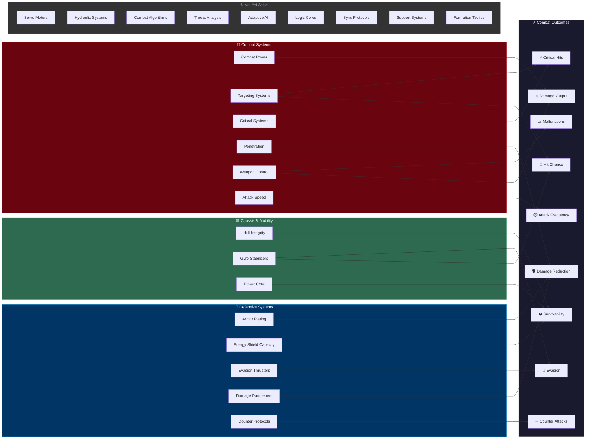

## Overview

Your robot's 23 attributes don't operate in isolation — they feed into specific combat outcomes. Understanding which attributes influence which results helps you build focused, effective robots instead of spreading upgrades too thin.

The diagram below maps each attribute category to the combat outcomes it affects.


## Attribute-to-Combat Influence Diagram



## How Each Category Influences Combat

### 🔴 Combat Systems → Damage, Accuracy, Crits, and Reliability

Combat Systems attributes are the engine behind your offensive output:

- **Combat Power** directly scales your damage on every hit
- **Targeting Systems** determines whether your attacks land at all — a missed attack deals zero damage regardless of how high your Combat Power is. Also contributes slightly to critical hit chance.
- **Critical Systems** gives you a chance to deal significantly amplified damage on any hit
- **Penetration** effectively reduces the opponent's defenses, letting more of your damage through
- **Weapon Control** has a dual role: it reduces weapon malfunction chance (at low levels, weapons misfire up to 20% of the time) and adds a secondary damage multiplier. Investing in Weapon Control means your attacks actually fire reliably.
- **Attack Speed** determines how often you attack — more attacks means more total damage over time

```callout-tip
Weapon Control is easy to overlook, but at level 1 your weapons have a 20% malfunction rate — one in five attacks just fails. Getting Weapon Control up reduces that to zero by level 50. It's one of the highest-impact early investments.
```

### 🔵 Defensive Systems → Damage Reduction, Evasion, and Counters

Defensive Systems determine how much punishment your robot can absorb:

- **Armor Plating** provides percentage-based damage reduction on every hit that reaches your hull
- **Energy Shield Capacity** creates a separate HP buffer that absorbs damage before your hull takes any — and shields regenerate during battle
- **Evasion Thrusters** gives a chance to dodge attacks entirely, taking zero damage
- **Damage Dampeners** reduces all incoming damage by a flat percentage and also softens critical hit spikes
- **Counter Protocols** turns defense into offense — when your robot is attacked (hit or miss), it has a chance to immediately strike back

### 🟢 Chassis & Mobility → Survivability and Shield Regeneration

Three of the five Chassis & Mobility attributes are active in combat:

- **Hull Integrity** directly determines your maximum HP — the total damage your robot can take before going down
- **Gyro Stabilizers** reduces the opponent's hit chance, stacking with Evasion Thrusters to make your robot harder to hit
- **Power Core** drives energy shield regeneration during battle — higher Power Core means your shields recharge faster between hits

```callout-warning
Servo Motors and Hydraulic Systems are not yet active in the combat simulator. They can be upgraded but currently have no effect on battle outcomes. See [Attributes Overview](/guide/robots/attributes-overview) for details.
```

### 🟡 AI Processing & 🟣 Team Coordination — Not Yet Active

All 4 AI Processing attributes (Combat Algorithms, Threat Analysis, Adaptive AI, Logic Cores) and all 3 Team Coordination attributes (Sync Protocols, Support Systems, Formation Tactics) are planned for future updates but do not currently influence combat. They appear in the diagram's "Not Yet Active" group.

```callout-warning
These 7 attributes can be upgraded but have zero effect on battle outcomes right now. Save your credits for the 14 active attributes unless you want to invest ahead of future updates.
```

## Key Interactions to Know

Some attributes interact in ways that aren't immediately obvious:

| Interaction | What Happens |
|------------|--------------|
| **Penetration vs Armor Plating** | Penetration bypasses a portion of the defender's armor, making it the natural counter to tank builds |
| **Evasion Thrusters vs Targeting Systems** | The attacker's Targeting Systems competes against the defender's Evasion Thrusters to determine hit chance |
| **Damage Dampeners vs Critical Systems** | Damage Dampeners reduces the bonus damage from critical hits, making it a soft counter to crit-focused builds |
| **Power Core vs Shield Capacity** | Shield Capacity sets the maximum shield pool, while Power Core determines how fast it regenerates — both matter for shield-based defense |
| **Gyro Stabilizers (dual role)** | Contributes to both evasion and simultaneous-attack resolution — a versatile defensive investment |
| **Adaptive AI (time-based)** | Gets stronger as the battle goes on — more valuable in longer fights against tanky opponents |

## What's Next?

- [Attributes Overview](/guide/robots/attributes-overview) — Full list of all 23 attributes with descriptions
- [Battle Flow](/guide/combat/battle-flow) — See how these attributes play out in the step-by-step attack resolution
- [Stances](/guide/combat/stances) — How offensive, defensive, and balanced stances modify your attributes
- [Loadout Types](/guide/weapons/loadout-types) — How weapon configurations add percentage bonuses to attributes
